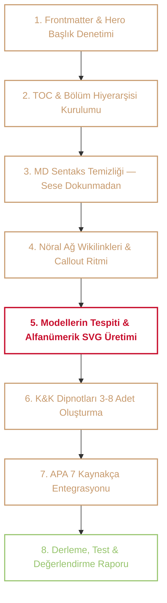

# 🏛️ SİKİLDİ.md — `sayko.ch` Evrensel İçerik, Tipografi ve Görselleştirme Anayasası

> **"Psikoloji: Kitapta durduğu gibi durmaz. Teori biter, maruz kalma başlar."**

Bu anayasa; `sayko.ch` üzerindeki tüm makalelerin metin formatını, tipografisini, nöral ağ (graph) bağlantılarını, kavram sözlüğünü (K&K), akademik kaynakçasını ve bilimsel/kavramsal modellerini tek bir atomik süreçte **İsviçre saati hassasiyetinde** üretmek ve denetlemek için oluşturulmuş **nihai süper-protokoldür**.

---

## 📑 İçindekiler

- [[#1. DOKUNULMAZ ALAN — Yazının Sesi ve Ruhu]]
- [[#2. Frontmatter Standardı]]
- [[#3. Tipografi, Başlık ve Renk Hiyerarşisi]]
- [[#4. TOC — İçindekiler ve Sayfa Mimarisi]]
- [[#5. Nöral Ağ (Graph View) ve Wikilink Protokolü]]
- [[#6. Callout Haritası ve Görsel Ritim]]
- [[#7. K&K (Kavramlar & Kelimeler / Footnotes) Sistemi]]
- [[#8. Akademik Kaynakça — APA 7 Standardı]]
- [[#9. Bilimsel Görselleştirme ve Model Mimarisi]]
  - [[#9.1 Alfanümerik Model Kodlama Standardı]]
  - [[#9.2 Saf Vektör (Inline Sayko SVG) İlkeleri]]
  - [[#9.3 Semantik Renk ve Çizgi Paleti]]
  - [[#9.4 Standart Callout Anatomisi]]
- [[#10. Yasaklı Tasarım Kalıpları (Forbidden Clichés)]]
- [[#11. Atomik Uygulama Workflow'u (Adım Adım)]]
- [[#12. Standart Çıktı & Değerlendirme Raporu Şablonu]]

---

## 1. DOKUNULMAZ ALAN — Yazının Sesi ve Ruhu

Formatlama yapılırken metnin **özüne, üslubuna, edebi ritmine ve sesine kesinlikle müdahale edilmez:**

- **Noktalama Özgürlüğü:** `......`, `—`, virgülsüz akış, kesik cümleler — hepsi kasıtlıdır; düzeltilmez.
- **Kelime Seçimi ve Söz Dizimi:** Sokak dili, akademik kaymalar, "tabi", "bi", "yani:", "lan", "genco" gibi samimi, sert ve otantik ifadeler aynen korunur.
- **Cümle ve Paragraf Yapısı:** Yazar nerede nefes almış, nerede bölmüşse orada kalır. Cümleler yapay olarak birleştirilmez veya bölünmez.
- **Mevcut Vurgular:** Yazarın koyduğu `==highlight==`, `*italik*` veya `**bold**` dengelerine dokunulmaz.
- **Sadece Sentaks Temizliği:** Hatalı veya yapışık yazılan Markdown kodları düzeltilir (Örn: `ben**bugün**` yerine `ben **bugün**`).

> [!danger] Altın Kural
> Eğer bir değişiklik yazının içeriğine, tona, söz dizimine veya kelime seçimine dokunuyorsa **ASLA YAPILMAZ**. Sadece formatlama, linkleme, kavramlaştırma ve görsel modelleme yapılır.

---

## 2. Frontmatter Standardı

Vault veri düzenini, Quartz derleyicisini ve arama motorunu temiz tutmak için sadece üç zorunlu alan kullanılır:

```yaml
---
title: Notun Başlığı
date: 2026-06-25
tags:
  - sağlık-psikolojisi
  - beslenme-psikolojisi
---
```

- `date`: Her zaman ISO 8601 formatında (`YYYY-MM-DD`). Yazının gerçek yazım tarihi kesinlikle korunur!
- `tags`: YAML list formatında — tek satırda virgülle değil, her etiket ayrı satırda `- etiket` şeklinde.
- `aliases`, `cssclasses`, `status` gibi ekstra kalabalık alanlar eklenmez.

---

## 3. Tipografi, Başlık ve Renk Hiyerarşisi

Sitedeki tüm yazılar otantik bir edebi/akademik kimlikle render edilir:

| Öğe / Seviye | Font Ailesi | Renk & Stil | Açıklama |
| :--- | :--- | :--- | :--- |
| **Hero Başlık (`h1.article-title`)** | `Manufacturing Consent` | Normal Koyu Başlık | Glifin hemen altındaki asil sayfa başlığı (Markdown gövdesinde `#` tekrar yazılmaz). |
| **`h2` (Ana Bölüm Başlıkları)** | `Manufacturing Consent` | Cardinal Kırmızı (`#C8102E`) | Gotik/blackletter asil bölüm durakları (`## 1. Konu...`, `## 2. Konu...`). |
| **`## İçindekiler` (TOC Başlığı)** | `Playfair Display` | Sepia / Altın Vurgu | Zarif, küçük ve büyük harfli temiz içindekiler göstergesi. |
| **`h3` / `h4` (Alt Başlıklar)** | `Source Serif 4` / `Libre Baskerville` | İtalik / Yarı-Kalın | Akışı kesmeyen okunaklı alt konu başlıkları. |
| **Gövde Metni & Tanımlar** | `Libre Baskerville` | Nötr Gövde Rengi | Yüksek okunurluklu klasik serif gövde. |
| **K&K ve Kaynakça Başlıkları** | `Manufacturing Consent` | Cardinal Kırmızı (`#C8102E`) | `## Kaynaklar` veya akordiyon başlıkları. |
| **Metin İçi Vurgu & Renkler** | Inline CSS / Semantic | İsteğe Bağlı | `<span style="color:#C8102E">...</span>` veya `==highlight==`. |

---

## 4. TOC — İçindekiler ve Sayfa Mimarisi

Uzun notlarda (3 veya daha fazla ana başlık içeren) frontmatter'dan hemen sonra eklenir:

```markdown
## İçindekiler

- [[#1. Birinci Başlık]]
- [[#2. İkinci Başlık]]
  - [[#Alt Başlık]]
- [[#3. Üçüncü Başlık]]
```

- Mükerrer sayfa başlığı (`# Başlık`) gövdeye yazılmaz; Quartz doğrudan frontmatter'daki `title` alanını hero başlık olarak derler.
- TOC listesinde `1. [[#1. ...]]` yerine madde imi `- [[#1. ...]]` kullanılır.
- TOC içindeki linkler her zaman aynı not içi syntax olan `[[#Başlık]]` formatındadır.

---

## 5. Nöral Ağ (Graph View) ve Wikilink Protokolü

`sayko.ch` vault'u yaşayan bir nöral ağdır. Graph View'ın tam kapasite çalışması ve kopuk düğüm oluşmaması için:

```markdown
[[Not Adı]]                        Vault içi doğrudan link
[[Not Adı|Görünen Metin]]          Özel görünen metin ile bağlamsal link
[[Not Adı#Başlık]]                 Spesifik başlığa yönlendirme
[[#Aynı notta başlık]]             Aynı not içi başlık linki
```

1. **Birebir Eşleşme:** Wikilink hedefi vault'taki gerçek dosya adıyla harfi harfine eşleşmelidir.
2. **Çifte Linkleme:** Hem kavramların yalın halleri (`[[Öz-Yeterlilik]]`) hem de cümle akışındaki bağlamsal ifadeler (`[[Sağlık Modelleri|modellere yaklaşımımız]]`) linklenir.
3. **Şüphe Durumu:** Vault'ta karşılığı olup olmadığından emin olunmayan linkler Obsidian yorumu içine alınır: `%%KONTROL: bu dosya vault'ta var mı?%% [[Klinik Psikolojide Metotlar]]`.

---

## 6. Callout Haritası ve Görsel Ritim

Yazının "dümdüz bir metin bloku" gibi görünmesini engellemek ve okuma temposunu artırmak için uygun yerlerde semantik çağrı kutuları kullanılır:

| Callout Tipi | Ne Zaman Kullanılır? |
| :--- | :--- |
| `[!abstract]` | **Bilimsel modeller, görsel diyagramlar** ve bölüm süper-özetleri. |
| `[!info]` | Bağlamsal açıklama — "yani şu demek", tanım genişletme. |
| `[!note]` | Yan gözlem — parantez içi parlamaları dışarı alma, akışı kesmeyen notlar. |
| `[!tip]` | Pratik çıkarım, eylem ve uygulama önerisi. |
| `[!example]` | Somut vaka, analoji, senaryo. |
| `[!warning]` | Metodolojik tuzak, niyet-davranış açmazı, yaygın yanılgı. |
| `[!quote]` | Dış alıntı veya yazarın vurucu özet aforizması. |
| `[!question]` | Açık soru, okuyucuyu kışkırtan düşünce deneyi. |
| `[!danger]` | Kritik hata riski, yıkıcı kısırdöngü veya AVE uyarısı. |

---

## 7. K&K (Kavramlar & Kelimeler / Footnotes) Sistemi

Her yazının içinde geçen; genel okuyucunun veya alana daha az aşina olanların tam bilemeyeceği terimler, sendromlar ve jargonlar dipnot olarak işaretlenir:

- **Sayı Dengesi:** Yazının yoğunluğuna göre **en az 3, en fazla 8** kavram seçilir.
- **Konum:** Metin içinde kavramın hemen ardına `[^kavram]` eklenir. Açıklamalar yazının sonunda, **Kaynakça bölümünün hemen üstünde** yer alır.
- **İçerik:** Ansiklopedi kuruluğunda değil; kısa, net, `sayko.ch` üslubuna uygun akademik/profesyonel açıklama.

```markdown
Metin içerisinde geçen kısıtlayıcı yeme davranışı[^kisitlayici-yeme] ve hedonik açlık[^hedonik-aclik] mekanizması...

---

[^kisitlayici-yeme]: **Kısıtlayıcı Yeme (Restrained Eating):** Bireyin kilo kontrolü amacıyla biyolojik açlık sinyallerini bilişsel olarak bastırması; genellikle kontrol kaybı ve tıkınırcasına yeme nöbetleriyle sonuçlanan riskli örüntü.
[^hedonik-aclik]: **Hedonik Açlık (Hedonic Hunger):** Enerji ihtiyacı olmaksızın, salt ödül ve zevk merkezli (dopaminerjik) besin arayışı ve tüketimi dürtüsü.
```

---

## 8. Akademik Kaynakça — APA 7 Standardı

`sayko.ch`'nin bilimsel omurgasıdır. Yazının dayandığı tüm teorik/ampirik literatür metnin **en sonuna** `## Kaynaklar` başlığı altında eklenir.

- **Hard Limit Yok:** Min/max sınırı yoktur; metnin ihtiyacı kadar (1-15 kaynak) tam doğrulukla eklenir.
- **Format:** Bütün kaynaklar **APA 7** formatında ve DOI/URL linkiyle yazılır.
- **Metin İçi Atıf:** Metin içinde `(Bandura, 1997)` veya `Stroebe ve ark. (2013)` şeklinde referans verilir.

```markdown
## Kaynaklar

- Herman, C. P., & Polivy, J. (1980). Restrained eating. In A. J. Stunkard (Ed.), *Obesity* (pp. 208–225). Saunders.
- Stroebe, W., van Koningsbruggen, G. M., Papies, E. K., & Aarts, H. (2013). Why most dieters fail but some succeed: A goal conflict model of eating behavior. *Psychological Review*, 120(1), 110–138. https://doi.org/10.1037/a0030849
```

---

## 9. Bilimsel Görselleştirme ve Model Mimarisi

Görselleştirme süs değildir; metnin teorik çekirdeğini kristalleştiren **bilişsel zihin modelidir**.

### 9.1 Alfanümerik Model Kodlama Standardı
Her model ve wild card için benzersiz alfanümerik kod kullanılır:
- **Kategori Harfi:** `S` (Sağlık), `K` (Klinik), `G` (Gelişim), `B` (Biliş), `İ` (İstatistik), `Y` (Yöntem), `N` (Nörobilim).
- **Makale No:** Kategorideki makale sırası (Örn: `S3` = Beslenme).
- **Model No:** O makale içindeki model sırası (Örn: `Model S3.1`, `Model S3.2`).
- **Wild Card No:** Metaforik/serseri modeller için `W` kodu (Örn: `Wild Card S3.W1`).

---

### 9.2 Saf Vektör (Inline Sayko SVG) İlkeleri
- **Sıfır Dış Bağımlılık:** Görseller kütüphane yükleme beklemez; doğrudan `<svg viewBox="..." width="100%" style="max-width: 680px; height: auto;">` olarak yerleştirilir.
- **Responsive & Dynamic Theme:** Metin renkleri `var(--dark)` veya CSS değişkenlerine bağlanır; hem koyu hem açık modda mükemmel okunur.
- **Tek Parça XML:** Markdown parser çakışmalarını önlemek için `<svg>` etiketleri arasında boşluksuz, temiz ve geçerli XML yapısı kullanılır.

---

### 9.3 Semantik Renk ve Çizgi Paleti

| Renk Sınıfı | HEX Kodu | Anlamı & Kullanım Alanı |
| :--- | :--- | :--- |
| **Cardinal** | `#C8102E` | Kriz anları, patoloji, merkezi tetikleyici, tökezleme (lapse), geri düşüş (relapse), yüksek risk, sabotaj. |
| **Sepia** | `#c79a6d` | Bilişsel filtreler, inançlar, öz-yeterlilik, niyet, zihinsel teraziler, çatışmalar. |
| **Sage** | `#96c46c` | Adaptif eylem, sağlıklı davranış, koruyucu faktör, toparlanma, perhizin korunması. |
| **Charcoal** | `#8a8275` | Dış çevre, pasif girdiler, nötr sistemler, biyolojik taban. |

---

### 9.4 Standart Callout Anatomisi

Her model `> [!abstract]` çağrı kutusu içinde, başlıksız emojisiz, ortalı yazar-yıl künyesiyle ve alt açıklamasıyla çerçevelenir:

```markdown
> [!abstract] Hedonik Yeme ve Hedef Çatışması Modeli
> <div class="sc-diag-author"><a href="https://doi.org/10.1037/a0030849" target="_blank" rel="noopener noreferrer">(Stroebe ve ark., 2013)</a></div>
>
> <div style="display:flex; justify-content:center; margin: 0.2rem 0 0.6rem 0;">
> <svg viewBox="0 0 620 260" width="100%" style="max-width: 680px; height: auto;">
>   <!-- Vektörel SVG Grafiği -->
> </svg>
> </div>
>
> *Bireyin lezzetli bir yiyecek kokusu aldığında haz hedefinin nasıl anında baskın hale gelip kilo kontrolü hedefini bilişsel olarak devre dışı bıraktığını modeller.*
>
> *Stroebe, W., et al. (2013). Why most dieters fail: A goal conflict model. Psychological Review, 120(1), 110–138. https://doi.org/10.1037/a0030849*
```

---

## 10. Yasaklı Tasarım Kalıpları (Forbidden Clichés)

Aşağıdaki klişeler Sayko.ch genelinde **KESİNLİKLE YASAKTIR**:
1. ❌ **Gereksiz Dashboard:** Dashboard gerektirmeyen metne panel/widget sıkıştırmak.
2. ❌ **Karanlıkta Mor/Neon:** Koyu temada mor/neon parlamalar.
3. ❌ **İlişkisiz İkon Yığını (Bento Box Cliché):** Alakasız süs ikonları doldurmak.
4. ❌ **Başlık Üstü Nabız Atan Hap (Biscuit Pill):** Başlık üzerine gereksiz noktalı hap rozetler koymak.
5. ❌ **Gradient Başlıklar:** Başlık kelimelerine ucuz CSS degrade efektleri basmak.
6. ❌ **Izgara/Mesh Arka Planlar:** Sayfa arkasına yapay grid çizgileri sermek.
7. ❌ **İç İçe 3 Kat Kart:** Kart içine kart, onun içine kart koymak.
8. ❌ **Callout Başlığında Emoji:** `[!abstract] 📜 Model` veya `📊 Grafik` şeklinde emoji kullanmak.

---

## 11. Atomik Uygulama Workflow'u (Adım Adım)

Bir makaleye `SİKİLDİ.md` yedirilirken şu sıra izlenir:



---

## 12. Standart Çıktı & Değerlendirme Raporu Şablonu

Her makale işlemi bittiğinde kullanıcıya aşağıdaki standart formatta kısa, öz ve net rapor sunulur:

```markdown
### 🏛️ SİKİLDİ.md İcraat Raporu: [Makale Adı]

1. **Yapılan İcraat:** 
   - [Frontmatter, TOC, Wikilinkler, Callout ritmi, MD temizliği özeti]
2. **K&K ve Kaynakça:**
   - [X adet K&K dipnotu eklendi, Y adet APA 7 kaynağı bağlandı]
3. **Üretilen Bilimsel Modeller:**
   - **Model [Kod]:** [Model Adı] — (Kaynak)
   - **Model [Kod]:** [Model Adı] — (Kaynak)
4. **🃏 Wild Card & Alternatif Öneriler:**
   - **Wild Card [Kod]:** [Serseri/Metaforik Fikir]
5. **🎯 Hazır Olma Skoru:** `%XX` *(Realist / Akademik / Serseri Gerekçesi)*
```

---
*C.Ç. © 2026 — SAYKO.ch Anayasası*
