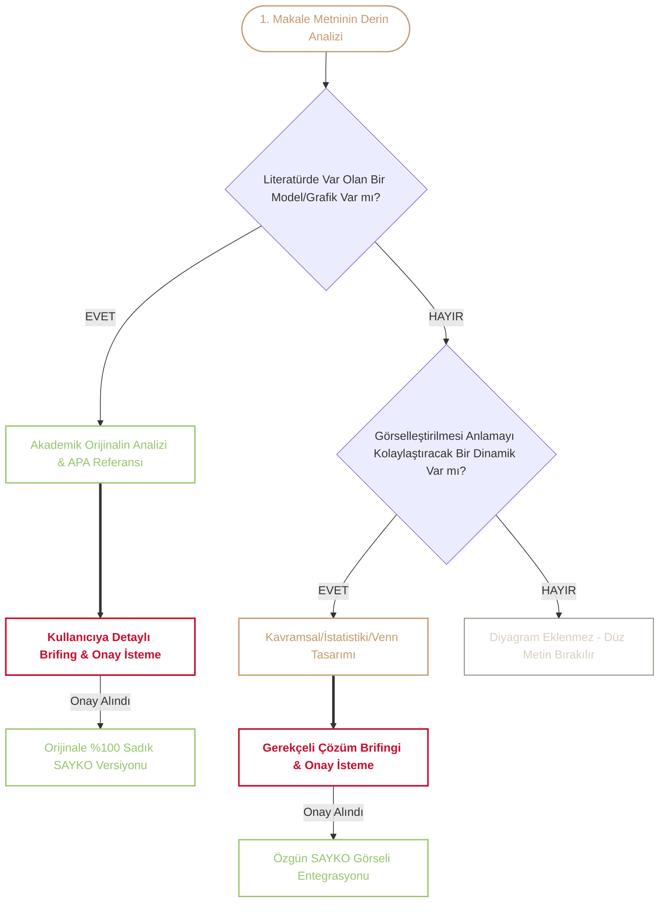

# 📐 SİKİL_DİYAGRAM.md — `sayko.ch` Evrensel Görselleştirme, Denetim ve Tasarım Kılavuzu

Bu belge; `sayko.ch` üzerindeki tüm makalelerin görsel ihtiyaçlarını denetlemek, literatürdeki bilimsel modelleri aslına sadık kalarak aktarmak ve en karmaşık psikolojik, felsefi, istatistiki ve tıbbi dinamikleri **İsviçre saati hassasiyetinde** görselleştirmek için oluşturulmuş **evrensel görselleştirme anayasasıdır**.

---

## İçindekiler

- [[#1. Temel Felsefe ve 3 Aşamalı Denetleme Protokolü]]
  - [[#Aşama 1: Literatür Taraması ve Var Olan Model Tespiti]]
  - [[#Aşama 2: Özel Kavramsal ve İstatistiki Görselleştirme Analizi]]
  - [[#Aşama 3: Kullanıcı Onayı ve Brifing Kuralı]]
- [[#2. SAYKO Görsel Cephaneliği: 30 Mermaid Türü & Psikoloji Eşleşme Ansiklopedisi]]
  - [[#2.1 Süreç ve Mantıksal Akış Modelleri]]
  - [[#2.2 Yapısal, Kavramsal ve Varlık Modelleri]]
  - [[#2.3 Dinamik Durum, Deneyim ve Yolculuk Haritaları]]
  - [[#2.4 Matris, Analiz ve Karar Modelleri]]
  - [[#2.5 Zaman, Evre ve Yaşam Çizgisi Haritaları]]
  - [[#2.6 Nicel, Veri ve Dağılım Grafikleri]]
- [[#3. Mermaid Dışındaki Dünya: İleri Vektör ve İstatistiki Araçlar]]
  - [[#3.1 Bespoke Inline Sayko SVG (Venn, Terazi, Ekolojik Küreler)]]
  - [[#3.2 Observable Plot ve Vega-Lite (D3 İstatistiki Veri Motoru)]]
  - [[#3.3 TikZ / LaTeX WebAssembly (Formel Nöral Ağlar)]]
- [[#4. Semantik Renk Paleti ve classDef Kuralları]]
- [[#5. Çizgi ve Bağlantı Semantiği]]
- [[#6. Standart Çerçeve (Kapsayıcı Callout ve Çifte Anlatı)]]
- [[#7. Zengin Şablon Kütüphanesi (Kopyala-Yapıştır)]]
  - [[#Şablon A: Kısırdöngü & Geri Bildirim (Feedback Loop)]]
  - [[#Şablon B: Aşamalı Eşik / Rubikon Geçişi (Stage & Rubicon)]]
  - [[#Şablon C: Ayırıcı Tanı Karar Ağacı (Diagnostic Tree)]]
  - [[#Şablon D: Quadrant Chart (4 Gözlü Bağlanma Matrisi)]]
  - [[#Şablon E: Ishikawa Balık Kılçığı (Etiyoloji Analizi)]]
  - [[#Şablon F: Timeline (Bilişsel Gelişim Zaman Çizgisi)]]
  - [[#Şablon G: Radar Chart (Big Five 5 Faktör Kişilik Profili)]]
  - [[#Şablon H: Vektörel Venn Kesişim Kümesi (Inline SVG)]]
  - [[#Şablon I: İç İçe Ekolojik Küreler (Bronfenbrenner SVG)]]
- [[#8. Teknik Standartlar, Mobil Uyum ve İnteraktif Zoom]]

---

## 1. Temel Felsefe ve 3 Aşamalı Denetleme Protokolü

Görselleştirme `sayko.ch` için süs değildir; metnin en karmaşık teorik çekirdeğini tek bakışta kristalleştiren **bilişsel bir zihin modelidir (Mental Model)**.

Her bir makale ele alınırken şu **3 Aşamalı Denetim Protokolü** işletilir:



### Aşama 1: Literatür Taraması ve Var Olan Model Tespiti
1. Yazı satır satır taranır. Metinde bahsi geçen kuramcıların (örn. Rogers PMT, Bandura Öz-Yeterlilik, Schwarzer HAPA, Bronfenbrenner Ekoloji, Solomon Karşıt-Süreç, Beck Bilişsel Üçlü, Marlatt AVE, Bartholomew Bağlanma Boyutları) uluslararası literatürde kabul görmüş **resmî bir akış şeması, grafiği veya modeli** var mı?
2. Tespit edilen modelin orijinal bileşenleri, ok yönleri ve terminolojisi çıkarılır.

### Aşama 2: Özel Kavramsal ve İstatistiki Görselleştirme Analizi
1. Metinde resmî bir model adı geçmiyorsa dahi: İki teorinin çatışması, iki disiplinin kesişimi (Venn), bir paradoks, çok faktörlü nedensellik veya istatistiki bir eğri var mı?
2. Eğer bir görsel bu bölümü dümdüz yazı olmaktan kurtarıp berrak kılacaksa, en uygun görsel format belirlenir.

### Aşama 3: Kullanıcı Onayı ve Brifing Kuralı (ZORUNLU)
- **Kesin Kural:** Hiçbir diyagram kullanıcıya danışılmadan doğrudan metne gömülmez.
- Her brifingde **2 zorunlu niceliksel değerlendirme metriği** ve varsa **Wild Card** yer alır:

```markdown
#### 🔍 Model [No]: [Modelin / Görselin Adı]
- **Metindeki Yeri:** [Bölüm Adı] (Satır XX-YY)
- **Literatür / Kavramsal Temel:** [APA Kaynağı veya Teorik Dinamik]
- **Önerilen Format:** [Semantik Mermaid / Vektörel Inline SVG / İstatistiki Plot]
- **1) İçerik & Okuyucu Yararlılık Skoru:** %XX *(Bu görsel konunun anlaşılması, arşiv değeri ve okuyucu zihni için ne kadar kritik?)*
- **2) Uygulama & Başarı Güven Skoru:** %XX *(Bu formatın teknik olarak %100 kusursuz, hatasız ve mobil duyarlı çalışma ihtimali).*
- **Görsel Tasarımı & Akış:** [Kısa özet]

---

#### 🃏 WILD CARD(s) (Varsa Alışılagelmişin Dışında / Absürt / Deneysel Fikirler)
- Metin analiz edilirken akla gelen zekice, absürt, ters köşe veya deneysel görsel metaforlar (örn. "Amfi Watt Gücü Göstergesi", "Genetik vs. Çevre Poker Masası", "Çocukluk Hamurunun Pişme Termometresi") buraya eklenir.
```

- Kullanıcı onay verirse görsel inşa edilir ve metne işlenir.

---

## 2. SAYKO Görsel Cephaneliği: 30 Mermaid Türü & Psikoloji Eşleşme Ansiklopedisi

Mermaid.js ekosisteminde yer alan tüm diyagram türlerinin `sayko.ch` üzerindeki psikolojik, psikiyatrik, felsefi ve metodolojik karşılıkları:

### 2.1 Süreç ve Mantıksal Akış Modelleri
1. **Flowchart (`flowchart TD / LR`):** Bilişsel karar modelleri (HAPA, TTM, PAPM), patolojik kısır döngüler, bilişsel filtreleme adımları.
2. **Swimlanes (`swimlanes`):** Çok aktörlü terapi ve sosyal etkileşim süreçleri (örn. *Danışan $\leftrightarrow$ Terapist $\leftrightarrow$ Aile Sistemi* paralel adımları).
3. **Sequence Diagram (`sequenceDiagram`):** Zaman sıralı diyaloglar, terapötik ittifak adımları, klasik/edimsel koşullanma uyaran-tepki sinyal zincirleri.
4. **ZenUML (`zenuml`):** Zihin-beden arasındaki anlık nörotransmitter ve hormon sinyalleşme dizileri.

### 2.2 Yapısal, Kavramsal ve Varlık Modelleri
5. **Class Diagram (`classDiagram`):** Psikopatoloji nozolojisi ve hiyerarşik bozukluk sınıflandırma ağaçları (örn. *Duygudurum Bozuklukları $\rightarrow$ Bipolar I / Bipolar II / Siklotimi* miras ilişkileri).
6. **Entity Relationship Diagram (`erDiagram`):** Klinik vaka kavramsallaştırması (örn. *Birey $\leftrightarrow$ Temel İnançlar $\leftrightarrow$ Ara İnançlar $\leftrightarrow$ Otomatik Düşünceler $\leftrightarrow$ Telafi Edici Stratejiler*).
7. **Mindmaps (`mindmap`):** Bir dersin veya teorinin alt kavram ağaçları, beyin fırtınası haritaları, semantik çağrışım ağları.
8. **TreeView (`treeView`):** DSM-5 ve ICD-11 taksonomik tanı ağaçları, nozolojik alt kategoriler.
9. **Block Diagram (`block-beta`):** Bilişsel ve nöroanatomik blok mimarileri (örn. Atkinson-Shiffrin Bellek Modeli: *Duyusal Bellek $\rightarrow$ KSB $\rightarrow$ USB*).
10. **Architecture (`architecture-beta`):** Nöral devre mimarileri (örn. *Prefrontal Korteks $\leftrightarrow$ Amigdala $\leftrightarrow$ Hipokampus $\leftrightarrow$ HPA Aksı* köprüleri).
11. **C4 Diagram (`c4`):** Biyo-Psiko-Sosyal çok düzeyli sistem bağlamı (Bireysel Sistem $\rightarrow$ Ailevi Sistem $\rightarrow$ Kurumsal Sistem $\rightarrow$ Makro Kültür).
12. **Packet (`packet-beta`):** Bilişsel bilgi işleme paketleri ve dikkat filtreleme katmanları (Duyu Girdisi $\rightarrow$ Kodlama $\rightarrow$ Konsolidasyon $\rightarrow$ Depolama).

### 2.3 Dinamik Durum, Deneyim ve Yolculuk Haritaları
13. **State Diagram (`stateDiagram-v2`):** Ruhsal durum makineleri (örn. Panik Döngüsü: *Sakin $\rightarrow$ Fizyolojik Uyarılma $\rightarrow$ Felaketleştirme $\rightarrow$ Panik Atağı $\rightarrow$ Güvenlik Arayışı $\rightarrow$ Kaçınma*).
14. **User Journey (`journey`):** Danışanın İyileşme / Terapi Yolculuğu (*Farkındalık $\rightarrow$ Direnç $\rightarrow$ İçgörü $\rightarrow$ Davranış Değişimi $\rightarrow$ Özerklik*).
15. **Event Modeling (`eventmodeling`):** Travma sonrası stres bozukluğu olay zincirleri (Tetikleyici Olay $\rightarrow$ Akut Şok $\rightarrow$ Flashback $\rightarrow$ Kronikleşme).
16. **Kanban (`kanban`):** Davranışçı tedavi ve maruz bırakma hiyerarşisi panoları (*Kaçınılan Durumlar $\rightarrow$ Maruz Bırakma $\rightarrow$ Duyarsızlaşma Kazanıldı*).

### 2.4 Matris, Analiz ve Karar Modelleri
17. **Quadrant Chart (`quadrantChart`):** 2 eksenli 4 gözlü matrisler:
    - *Bağlanma Stilleri:* Kaygı vs. Kaçınma $\rightarrow$ Güvenli, Saplantılı, Korkulu, Kayıtsız.
    - *Johari Penceresi:* Açık, Kör, Gizli, Bilinmeyen benlik alanları.
    - *Yerkes-Dodson:* Uyarılma vs. Performans çanı.
18. **Ishikawa (`ishikawa`):** Balık Kılçığı ile [[Etiyoloji]] ve Kök Neden Analizi (Bir bozukluğun Biyolojik, Genetik, Bilişsel, Sosyoçevresel kökleri).
19. **Venn (`venn`):** İki veya üç kuramın kesişim kümeleri (*Sağlık Psikolojisi $\cap$ Davranışsal Tıp $\cap$ Klinik Psikoloji*).
20. **Cynefin (`cynefin`):** Klinik Kriz Yönetimi ve Psikolojik Müdahale Matrisi (*Basit $\rightarrow$ Karmaşık $\rightarrow$ Kompleks $\rightarrow$ Kaotik*).
21. **Wardley (`wardley`):** Evrimsel psikoloji ve başa çıkma mekanizmalarının gelişim haritaları.
22. **Requirement Diagram (`requirementDiagram`):** DSM-5 tanı kriteri zorunluluk matrisleri (örn. Majör Depresyon 9 semptom kuralı).

### 2.5 Zaman, Evre ve Yaşam Çizgisi Haritaları
23. **Timeline (`timeline`):** Yaşam boyu gelişim evreleri (Freud psikoseksüel, Erikson psikososyal, Piaget bilişsel evreleri); Psikiyatri ve Psikoloji tarihi.
24. **Gantt (`gantt`):** Boylamsal gelişimsel araştırma desenleri (Longitudinal kohort takipleri) ve 12 haftalık BDT tedavi protokol takvimi.
25. **GitGraph (`gitgraph`):** Epigenetik dallanma, gelişimsel plastiklik ve alternatif yaşam yolları (Kelebek etkisi).

### 2.6 Nicel, Veri ve Dağılım Grafikleri
26. **XY Chart (`xychart-beta`):** Sayısal korelasyonlar, yaşa bağlı akışkan/kristalize zekâ eğrileri, doz-yanıt eğrileri (sigara tüketimi vs. kanser riski).
27. **Sankey (`sankey-beta`):** Popülasyon sağlık davranış akışları (*1000 Tiryakiden $\rightarrow$ 400 Bırakma $\rightarrow$ 80 Başarı / 320 Relapse akışı*).
28. **Radar (`radar-beta`):** Çok boyutlu kişilik profilleri (Big Five 5 Faktör radar grafiği: *Açıklık, Sorumluluk, Dışadönüklük, Uyumluluk, Nevrotiklik*).
29. **Treemap (`treemap`):** Bilişsel kaynak dağılımı, epidemiyolojik hastalık yükü (DALY) hiyerarşik oranları.
30. **Pie Chart (`pie`):** Prevalans dilimleri, genetik vs. çevre kalıtım yüzdeleri (%50 Gen / %50 Çevre).

---

## 3. Mermaid Dışındaki Dünya: İleri Vektör ve İstatistiki Araçlar

Mermaid'in sınırlarını aşan durumlarda devreye giren **İsviçre Saati 3'lü Vektör Motoru**:

### 3.1 Bespoke Inline Sayko SVG (Venn, Terazi, Ekolojik Küreler)
- **Kullanım Alanı:** Saydam çoklu Venn kümeleri, Bronfenbrenner'in dairesel ekolojik küreleri, zihin-beden diyalektik terazileri.
- **Teknik Özellik:** Sıfır kütüphane yükleme süresi, doğrudan Markdown içine `<svg viewBox="...">` olarak eklenir, `--accent` ve `--secondary` CSS değişkenleriyle senkronize çalışır, her ekran boyutunda kusursuz ölçeklenir.

### 3.2 Observable Plot ve Vega-Lite (D3 İstatistiki Veri Motoru)
- **Kullanım Alanı:** **İstatistik 1**, **Bilimsel Çalışma Yöntemleri** ve **Epidemiyoloji** makaleleri.
- **Uygulamalar:** Gauss normal dağılım çan eğrileri, hipotez testleri p-değer aralıkları, saçılım matrisleri (scatter plot), Doll 40 yıllık doktor çalışması sağkalım eğrileri.

### 3.3 TikZ / LaTeX WebAssembly (Formel Nöral Ağlar)
- **Kullanım Alanı:** Yapay ve biyolojik sinir ağları topolojisi, formel bilişsel mimariler ve matematiksel psikoloji formülleri.

---

## 4. Semantik Renk Paleti ve `classDef` Kuralları

Tüm şemalarda jenerik renkler kapatılmıştır; `sayko.ch` renk sınıfları kullanılır:

```mermaid
classDef cardinal fill:none,stroke:#C8102E,stroke-width:2.2px,color:#C8102E,font-weight:bold;
classDef sepia fill:none,stroke:#c79a6d,stroke-width:1.8px,color:#c79a6d;
classDef sage fill:none,stroke:#96c46c,stroke-width:1.8px,color:#96c46c;
classDef charcoal fill:none,stroke:#8a8275,stroke-width:1.2px,color:#d8cfc0;
```

| Renk Sınıfı | HEX Kodu | Semantik Anlamı & Kullanım Alanı |
| :--- | :--- | :--- |
| **`cardinal`** | `#C8102E` | Kriz anları, patoloji, merkezi tetikleyici, tökezleme (lapse), geri düşüş (relapse), yüksek risk. |
| **`sepia`** | `#c79a6d` | Bilişsel filtreler, inançlar, öz-yeterlilik, niyet, zihinsel arabulucu değişkenler. |
| **`sage`** | `#96c46c` | Adaptif eylem, sağlıklı davranış, koruyucu faktör, toparlanma, perhizin korunması. |
| **`charcoal`** | `#8a8275` | Makro bağlam, dış çevre katmanları, pasif girdiler, nötr sistemler. |

---

## 5. Çizgi ve Bağlantı Semantiği

| Ok / Çizgi Tipi | Sentaks | Anlamı ve Kullanımı |
| :--- | :---: | :--- |
| **Kalın / Baskın Ok** | `==>` | Otomatik sürüklenme, baskın nedensel akış, nörokimyasal zorunluluk veya yüksek riskli sapma. |
| **Standart Ok** | `-->` | Bilinçli adım, planlı eylem, standart evre ilerlemesi. |
| **Kesikli Ok** | `-.->` | Geri bildirim döngüsü (feedback loop), bastırılmış etki veya gecikmeli koşullu sonuç. |
| **Etiketli Bağlantı** | `-->|Koşul / Biliş|` | Düğümden geçerken tetiklenen inanç, şüphe veya çevresel engel. |

---

## 6. Standart Çerçeve (Kapsayıcı Callout ve Çifte Anlatı)

Her görsel metin içinde mutlaka `> [!abstract]` çağrı kutusu ile çerçevelenir:

```markdown
> [!abstract] 📜 [Modelin Tam Adı] ([Yazar], [Yıl])
> *Kaynak: [APA 7 formatında tam makale/kitap referansı ve DOI linki]*
>
> ```mermaid
> %% veya <svg ...>
> ```
>
> **Açıklama:** *[1. Cümle: Sistemin teorik / bilimsel mekanizmasının özeti]. [2. Cümle: Sokak diliyle / sezgisel olarak günlük hayattaki karşılığı ve ana çıkarım].*
```

---

## 7. Zengin Şablon Kütüphanesi (Kopyala-Yapıştır)

### Şablon A: Kısırdöngü & Geri Bildirim (Feedback Loop)
*Kullanım Alanı: Bağımlılık döngüsü, anksiyete sarmalı, öfke patlamaları, uyku-stres kısırdöngüsü.*

```markdown
> [!abstract] 📜 Bağımlılıkta Karşıt-Süreç Teorisi (Solomon & Corbit, 1974)
> *Kaynak: Solomon, R. L., & Corbit, J. D. (1974). An opponent-process theory of motivation. Psychological Review, 81(2), 119–145.*
>
> ```mermaid
> flowchart TD
>   classDef cardinal fill:none,stroke:#C8102E,stroke-width:2.2px,color:#C8102E,font-weight:bold;
>   classDef sepia fill:none,stroke:#c79a6d,stroke-width:1.8px,color:#c79a6d;
>   classDef default fill:none,stroke:#ece8e1,stroke-width:1.2px,color:#d8cfc0;
>
>   Madde([Tetikleyici / Madde Alımı]):::cardinal --> A_Sureci([A-Süreci: Anlık Haz & Dopamin]):::sepia
>   A_Sureci --> Dengeleme{{Homeostatik Karşı Tepki}}:::sepia
>   Dengeleme ==> B_Sureci([B-Süreci: Gecikmeli Çekilme & Disfori]):::cardinal
>   
>   B_Sureci -.->|Zamanla Derinleşir| Tolerans((Tiryakilik & Tolerans)):::cardinal
>   Tolerans ==>|Yoksunluğu Dindirmek İçin| Madde
> ```
>
> **Açıklama:** *İlk dönemde keyif almak için yapılan eylemin, zihnin homeostatik dengelenmesi sonucu zamanla sadece yoksunluk acısını dindirmek için bir zorunluluğa dönüşmesini açıklar.*
```

---

### Şablon B: Aşamalı Eşik / Rubikon Geçişi (Stage & Rubicon)
*Kullanım Alanı: HAPA, TTM Değişim Basamakları, PAPM, Karar Anları.*

```markdown
> [!abstract] 📜 Sağlık Eylemi Süreci Yaklaşımı / HAPA Modeli (Schwarzer, 1992)
> *Kaynak: Schwarzer, R. (1992). Self-efficacy in the adoption and maintenance of health behaviors. Hemisphere Publishing.*
>
> ```mermaid
> flowchart LR
>   classDef cardinal fill:none,stroke:#C8102E,stroke-width:2.2px,color:#C8102E,font-weight:bold;
>   classDef sepia fill:none,stroke:#c79a6d,stroke-width:1.8px,color:#c79a6d;
>   classDef sage fill:none,stroke:#96c46c,stroke-width:1.8px,color:#96c46c;
>   classDef charcoal fill:none,stroke:#8a8275,stroke-width:1.2px,color:#d8cfc0;
>
>   subgraph Motivasyon [1. Motivasyonel Faz]
>     Risk[Risk & Tehdit Algısı]:::charcoal --> Niyet([Eylem Niyeti]):::sepia
>     Beklenti[Sonuç Beklentisi]:::charcoal --> Niyet
>     OzYet_Baslangic[Başlangıç Öz-Yeterliliği]:::sepia --> Niyet
>   end
>
>   Niyet ==>|Rubikon Geçişi| Planlama
>
>   subgraph Volisyon [2. Volisyonel Eylem Fazı]
>     Planlama{{Eylem & Başa Çıkma Planı}}:::sepia ==> Eylem([Sağlıklı Eylem]):::sage
>     Eylem -.->|Engel / Tökezleme| BasaCikma[Başa Çıkma Öz-Yeterliliği]:::sepia
>     BasaCikma ==> Eylem
>   end
> ```
>
> **Açıklama:** *Kişinin 'biliyorum ama yapamıyorum' dediği motivasyon aşamasından, planlama ve başa çıkma iradesiyle eyleme geçtiği Rubikon köprüsünü resmeder.*
```

---

### Şablon C: Ayırıcı Tanı Karar Ağacı (Diagnostic Tree)
*Kullanım Alanı: Klinik tanılar, Normal vs. Anormal ayrımı, Diferansiyel teşhis.*

```markdown
> [!abstract] 📜 Ruhsal Belirti Değerlendirme & Ayırıcı Tanı Karar Matrisi
> *Kaynak: American Psychiatric Association. (2013). Diagnostic and statistical manual of mental disorders (5th ed.).*
>
> ```mermaid
> flowchart TD
>   classDef cardinal fill:none,stroke:#C8102E,stroke-width:2.2px,color:#C8102E,font-weight:bold;
>   classDef sepia fill:none,stroke:#c79a6d,stroke-width:1.8px,color:#c79a6d;
>   classDef sage fill:none,stroke:#96c46c,stroke-width:1.8px,color:#96c46c;
>
>   Girdi([Belirti / Yoğun Stres Yaşantısı]):::sepia --> Soru1{Kültürel & Durumsal Olarak Kabul Gören Bir Tepki mi?}
>   
>   Soru1 -- Evet --> Normal[Uyum Tepkisi / Normal Yaşantı]:::sage
>   Soru1 -- Hayır --> Soru2{Belirgin İşlev Kaybı ve Acı / Distres Var mı?}
>   
>   Soru2 -- Hayır --> Subklinik[Subklinik Zorlanma / Takip]:::sepia
>   Soru2 -- Evet --> Soru3{Belirtiler Süre ve Sendrom Kriterini Karşılıyor mu?}
>   
>   Soru3 -- Hayır --> GeciciKriz[Akut Yaşam Krizi]:::sepia
>   Soru3 -- Evet ==> Bozukluk([Klinik Ruhsal Bozukluk Tanısı]):::cardinal
> ```
>
> **Açıklama:** *Her duygusal acının bir bozukluk olmadığını; tanı koyabilmek için bağlam, işlev kaybı ve zaman eşiklerinin adım adım sorgulanması gerektiğini ortaya koyar.*
```

---

### Şablon D: Quadrant Chart (4 Gözlü Bağlanma Matrisi)
*Kullanım Alanı: Bağlanma stilleri, Johari penceresi, Duygu-Uyarılma (Circumplex) modelleri.*

```markdown
> [!abstract] 📜 Yetişkin Bağlanma Boyutları ve Stilleri (Bartholomew & Horowitz, 1991)
> *Kaynak: Bartholomew, K., & Horowitz, L. M. (1991). Attachment styles among young adults: A test of a four-category model. Journal of Personality and Social Psychology, 61(2), 226–244.*
>
> ```mermaid
> quadrantChart
>   title Bağlanma Stilleri Matrisi
>   x-axis Düşük Kaçınma --> Yüksek Kaçınma
>   y-axis Düşük Kaygı --> Yüksek Kaygı
>   quadrant-1 Saplantılı (Preoccupied)
>   quadrant-2 Korkulu-Kaçıngan (Fearful)
>   quadrant-3 Güvenli (Secure)
>   quadrant-4 Kayıtsız-Kaçıngan (Dismissing)
> ```
>
> **Açıklama:** *Kişinin benlik ve öteki algısının, kaygı ve kaçınma eksenlerindeki kesişiminin oluşturduğu 4 temel ilişki dinamizmini gösterir.*
```

---

### Şablon E: Ishikawa Balık Kılçığı (Etiyoloji Analizi)
*Kullanım Alanı: Depresyon, Bağımlılık veya Kardiyovasküler hastalıkların çok faktörlü kök neden analizi.*

```markdown
> [!abstract] 📜 Depresyonun Biyopsikososyal Etiyoloji Kılçığı
> *Kaynak: Engel, G. L. (1977). The need for a new medical model. Science, 196(4286), 129–136.*
>
> ```mermaid
> ishikawa
>   title Depresif Tablo Etiyolojisi
>   Genetik: Poligenik Risk, Aile Öyküsü, 5-HTTLPR
>   Nörobiyoloji: HPA Aksı Hiperaktivitesi, Monoamin Düşüşü
>   Bilişsel: Olumsuz Şemalar, Öğrenilmiş Çaresizlik, Katastrofize Etme
>   Sosyoçevresel: Yalnızlık, Sosyoekonomik Baskı, Akut Yaşam Kaybı
> ```
>
> **Açıklama:** *Ruhsal rahatsızlıkların tek bir faktörle açıklanamayacağını; biyolojik, bilişsel ve sosyal bileşenlerin birleşik bir baskı oluşturduğunu resmeder.*
```

---

### Şablon F: Timeline (Bilişsel Gelişim Zaman Çizgisi)
*Kullanım Alanı: Bilişsel gelişim basamakları, tanı sistemlerinin tarihsel evrimi.*

```markdown
> [!abstract] 📜 Piaget'nin Bilişsel Gelişim Basamakları Zaman Çizgisi
> *Kaynak: Piaget, J. (1952). The origins of intelligence in children. International Universities Press.*
>
> ```mermaid
> timeline
>   title Bilişsel Gelişim Evreleri
>   section 0-2 Yaş
>     Duyusal-Motor : Nesne Sürekliliği : Reflekslerden Amaçlı Eyleme
>   section 2-7 Yaş
>     İşlem Öncesi : Benmerkezcilik : Sembolik Düşünce
>   section 7-11 Yaş
>     Somut İşlemler : Korunum İlkesi : Sınıflandırma Mantığı
>   section 11+ Yaş
>     Soyut İşlemler : Hipotetik-Tümdengelim : Soyut Muhakeme
> ```
>
> **Açıklama:** *İnsan aklının bilgiyi işleme kapasitesinin basamak basamak niteliksel sıçramalarla nasıl genişlediğini gösterir.*
```

---

### Şablon G: Radar Chart (Big Five 5 Faktör Kişilik Profili)
*Kullanım Alanı: Kişilik profilleri, çok değişkenli yetenek/mizaç değerlendirmeleri.*

```markdown
> [!abstract] 📜 Beş Faktör Kişilik Profili Karşılaştırması (Costa & McCrae, 1992)
> *Kaynak: Costa, P. T., & McCrae, R. R. (1992). Revised NEO Personality Inventory (NEO PI-R). PAR.*
>
> ```mermaid
> radar
>   axis Açıklık, Sorumluluk, Dışadönüklük, Uyumluluk, Nevrotiklik
>   curve Tip A {4, 5, 2, 4, 1}
>   curve Tip B {2, 2, 4, 3, 5}
>   max 5
> ```
>
> **Açıklama:** *Beş temel kişilik boyutunun bireyler arasındaki dağılımını ve dengesini çok eksenli bir radar üzerinde gösterir.*
```

---

### Şablon H: Vektörel Venn Kesişim Kümesi (Inline SVG)
*Kullanım Alanı: Disiplin kesişimleri, Biyo-Psiko-Sosyal model.*

```markdown
> [!abstract] 📜 Klinik Psikoloji, Davranışsal Tıp ve Sağlık Psikolojisi Kesişim Alanı
>
> <div style="display:flex; justify-content:center; margin: 1.5rem 0;">
>   <svg viewBox="0 0 500 320" width="100%" style="max-width: 480px; height: auto;">
>     <circle cx="200" cy="160" r="110" fill="rgba(200, 16, 46, 0.12)" stroke="#C8102E" stroke-width="2"/>
>     <circle cx="300" cy="160" r="110" fill="rgba(199, 154, 109, 0.12)" stroke="#c79a6d" stroke-width="2"/>
>     <text x="140" y="165" fill="var(--dark)" font-family="var(--bodyFont)" font-size="14" font-weight="bold" text-anchor="middle">Klinik Psikoloji</text>
>     <text x="360" y="165" fill="var(--dark)" font-family="var(--bodyFont)" font-size="14" font-weight="bold" text-anchor="middle">Davranışsal Tıp</text>
>     <text x="250" y="155" fill="#C8102E" font-family="var(--bodyFont)" font-size="13" font-weight="bold" text-anchor="middle">Sağlık</text>
>     <text x="250" y="175" fill="#C8102E" font-family="var(--bodyFont)" font-size="13" font-weight="bold" text-anchor="middle">Psikolojisi</text>
>   </svg>
> </div>
>
> **Açıklama:** *Sağlık psikolojisinin, ruhsal bozukluklarla ilgilenen klinik disiplin ile somatik tıbbı birleştiren davranışsal tıp ekseninin tam kesişiminde yer aldığını gösterir.*
```

---

### Şablon I: İç İçe Ekolojik Küreler (Bronfenbrenner SVG)
*Kullanım Alanı: Gelişim Psikolojisi ekolojik sistemleri.*

```markdown
> [!abstract] 📜 Bronfenbrenner Biyoekolojik Sistemler Küresi
>
> <div style="display:flex; justify-content:center; margin: 1.5rem 0;">
>   <svg viewBox="0 0 500 500" width="100%" style="max-width: 460px; height: auto;">
>     <circle cx="250" cy="250" r="230" fill="rgba(138, 130, 117, 0.05)" stroke="#8a8275" stroke-width="1.5" stroke-dasharray="4"/>
>     <circle cx="250" cy="250" r="175" fill="rgba(138, 130, 117, 0.08)" stroke="#8a8275" stroke-width="1.5"/>
>     <circle cx="250" cy="250" r="120" fill="rgba(199, 154, 109, 0.12)" stroke="#c79a6d" stroke-width="1.8"/>
>     <circle cx="250" cy="250" r="65" fill="rgba(200, 16, 46, 0.15)" stroke="#C8102E" stroke-width="2.2"/>
>     <text x="250" y="255" fill="#C8102E" font-family="var(--bodyFont)" font-size="13" font-weight="bold" text-anchor="middle">Birey (Biyoloji)</text>
>     <text x="250" y="160" fill="#c79a6d" font-family="var(--bodyFont)" font-size="12" font-weight="bold" text-anchor="middle">Mikrosistem (Aile & Okul)</text>
>     <text x="250" y="105" fill="#8a8275" font-family="var(--bodyFont)" font-size="12" font-weight="bold" text-anchor="middle">Ekzosistem (İşyeri & Kurumlar)</text>
>     <text x="250" y="50" fill="#8a8275" font-family="var(--bodyFont)" font-size="12" font-weight="bold" text-anchor="middle">Makrosistem (Kültür & Kanunlar)</text>
>   </svg>
> </div>
>
> **Açıklama:** *Bireyin gelişiminin, içten dışa doğru genişleyen ve birbirini çevreleyen çok katmanlı biyoekolojik sistemlerin içinde şekillendiğini gösterir.*
```

---

## 8. Teknik Standartlar, Mobil Uyum ve İnteraktif Zoom

1. **SVG Çizgi ve Doldurma (Fill) Kuralı:** Bağlantı çizgileri (`.edgePath path`, `.flowchart-link`) kesinlikle `fill: none` olarak stillendirilir.
2. **İnteraktif Tam Ekran Zoom:** Her diyagramın sağ üstünde otomatik `🔍 İncele` butonu belirir ve çift tıklama ile tam ekran modal açılır.
3. **Düğüm İsimlendirmeleri:** Düğümlerde uzun cümleler yerine 2-4 kelimelik keskin kavramlar kullanılır; detaylar callout altındaki **Açıklama** paragrafına bırakılır.
