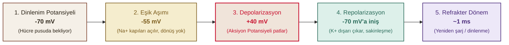
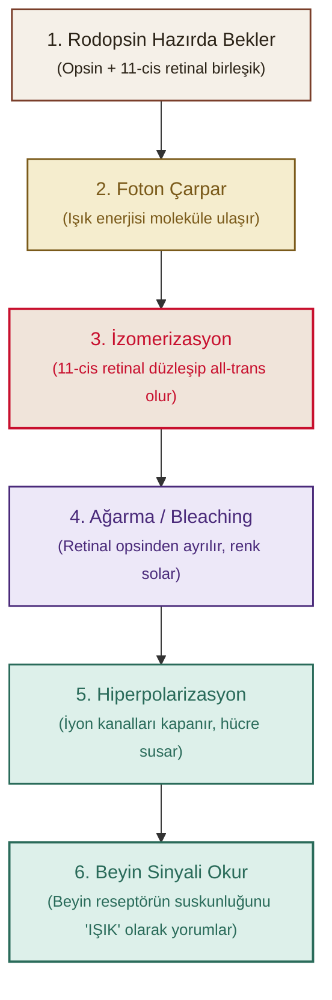

## İçindekiler

- [[#Algı Psikolojisi: Ne Gördüğümüzü Nereden Biliyoruz?]]
- [[#1. Işık Değil Dalga Boyu — Algının İstatistiki Doğası]]
- [[#2. Uzun İnce Bir Yol — Çevreden Eyleme 7 Durak]]
- [[#3. Psikofizik: Algıyı Ölçmek]]
  - [[#Mutlak Eşik]]
  - [[#Fark Eşiği ve Weber Kanunu]]
  - [[#Fechner'in 3 Klasik Eşik Metodu]]
  - [[#Stevens'ın Güç Yasası — Sıkışma ve Patlama]]
- [[#4. Sinyal Algılama Kuramı (SDT) — Kulak vs. Karakter]]
  - [[#Duşta Çalan Telefon Analojisi (Kevser vs. Mülayim)]]
  - [[#2x2 Karar Matrisi ve Duyarlılık Formülü]]
- [[#5. Duyu Fizyolojisi — Nöron Doktrini ve Aksiyon Potansiyeli]]
  - [[#Cajal ve Nöron Doktrini]]
  - [[#Aksiyon Potansiyeli ve İyonik Fedai Pompası]]
  - [[#Değişmez 3 Kıstas: Ya Hep Ya Hiç, Refrakter Süre ve Frekans Kodlaması]]
  - [[#Sinapslar: Gaz (EPSP), Fren (IPSP) ve Büyük Toplama]]
- [[#6. Gözün Optiği — Biyolojik Fotoğraf Makinesi ve Kırma Kusurları]]
  - [[#Larry Hester ve Görünür Spektrum]]
  - [[#Gözün Yapısı: Kornea, Lens ve Fotoreseptörler]]
  - [[#Odaklanma ve Presbiyopi: Lensin Emekliliği]]
  - [[#Kırma Kusurları ve Beynin Photoshop Mesaisi]]
  - [[#Kısa Exkurs: Gerçeklik Gerçekten Bulanık Olamaz mı?]]
- [[#7. Retina: Işığın Aydınlattığı Mahalle]]
  - [[#Fototransdüksiyon]]
  - [[#Karanlıkta Rodopsin Yeniden Doğuyor]]
  - [[#Karanlık Adaptasyonu ve Kohlrausch Kırılması]]
  - [[#Alacakaranlıkta Renklerin İhaneti: Purkinje Kayması]]
  - [[#Fedakârlık vs. Zekâ: Konverjans]]
  - [[#Yanal Engelleme: Mahalle Baskısı ve Limulus]]
- [[#Kavramlar ve Kelimeler]]
- [[#Kaynaklar]]

---

## Algı Psikolojisi: Ne Gördüğümüzü Nereden Biliyoruz?

Algı Psikolojisi...

Ne gördüğümüzü nereden biliyoruz?

Ya da gördüğümüz şeyin gerçekten de "gördüğümüz şey" olduğunu?

> [!quote] Kurt Koffka (1886 – 1941)
> *"Why do things look as they do?"*

Gördüklerimizin nasıl oluyor da gördüğümüz gibi göründüğünü de içine alan geniş bir konu, algı psikolojisi.

New York Times'ın Temmuz '58 sayısında "Elektronik Beyin Kendi Kendine Öğreniyor" isminde ilginç bir makale yayınlanmış.

Makalede bahsedilen şey, yeni ve devrim potansiyelinde bir teknolojik gelişme: Perceptron[^perceptron] adında elektronik bir bilgisayar. Yaklaşık 1 yıl içinde tamamlandığında, insan eğitimi veya denetimi olmadan, çevresini algılayabilen, tanıyabilen ve tanımlayabilen ilk cansız mekanizma olması beklenmektedir...

İlk Perceptron'u yapan psikolog Frank Rosenblatt (1958). Oda boyutunda, tam beş ton ağırlığında bir makine düşün..
Kendi kendine öğreniyor: solda işaret olan kart mı, sağda işaret olan kart mı, ayırt edebiliyor. Henüz o kadar oluyor..
Rosenblatt diyor ki bu cihaz “optik, elektriksel ya da tonal bilgi örüntüleri arasındaki benzerlikleri veya özdeşlikleri, biyolojik bir beynin algısal süreçlerine bayağı benzer şekilde tanımayı öğrenebilir”.
Yani adam resmen **"bu makine beyin gibi algılayacak"** diyor. Üstelik Rosenblatt ve o dönemin bilgisayarcıları, Perceptron gibi bir "algılayan makineyi" yapmak için on yıl falan yeterli diyorlar, biraz iyimserler. Yani *insan gibi* çevreyi kolaylıkla anlayabilen ve içinde hareket edebilen bir makine on yıla hazır olur diye düşünüyorlar.

Açık konuşmak gerekirse Rosenblatt'ın Perceptron'u insan algısını taklit etmekte pek de başarılı olamadı.

O beş tonluk Perceptron: solda mı sağda mı işaret var, onu bile **50** denemede/turda öğreniyordu. Bugünden bakınca komik geliyor, çünkü artık telefonundaki bir uygulama saniyeler içinde yüz tanıyor, sahne anlatıyor, hatta video izliyor/yaratıyor. 
Rosenblatt'ın "makine algılayabilir" fikri ==bugünkü yapay zekânın ve özellikle derin öğrenmenin (deep learning) öncüsü/ilk adımı== sayılıyor ve kimse bunu tartışmıyor.

Ama işin *ilginç* tarafı şu: Aradan neredeyse 70 yıl geçti, sistemler inanılmaz hale geldi ama "insan gibi algılama" konusunda **net** bir cevap yok..

2020'lerin ortasında görsel-dil modelleri fotoğrafa bakıp yalnızca "pistte uçak var" demiyor; hava gösterisi olduğunu, insanların ziyaretçi olduğunu, *hatta* fotoğrafın duygusal tonunu bile söyleyebiliyor.
**Ama bu, "algı" denen şeyin birebir aynısı mı?**
*İşte orası hâlâ tartışmalı..*
Çünkü insan algısı *sadece etiketleme değil*; beden, bellek, duygu ve bağlamla iç içe işleyen bir süreç. Bugünün modelleri inanılmaz derecede iyi birer örüntü makinesi ancak bu süreçlerin fenomenolojik olarak insan deneyimiyle aynı doğada olup olmadığı sorusu hâlâ açıktır.

Peki o zaman algı neden bu kadar zor? Neden makineler uzun süre bunu yapamadı? İşte **tam da bu noktada** Koffka'nın sorusuna geri dönüyoruz.

---

## 1. Işık Değil Dalga Boyu — Algının İstatistiki Doğası

Kurt Koffka az önce yazının başında da sorduğumuz o meşhur soruyu sorduğunda... yani: "Neden şeyler göründüğü gibi görünür?" şöyle düşünebiliriz:

Gözünü açıyorsun ve dünyayı görüyorsun: renkler, biçimler, derinlik, hareket. Kulaklarınla sesleri duyuyorsun.
Peki bu deneyimler gerçekten **"dışarıda"** mı?

Fizik açısından bakınca işler tuhaflaşıyor:

* Dış dünyada **renk yok**. Işık var; elektromanyetik spektrumun dar bir dilimi var. "Kırmızı" denen şey, o dalga boyunun beyinde yarattığı bir *deneyim*.
* Dış dünyada **ses de yok**! Havada basınç dalgaları var. "Kuş sesi" dediğimiz şey, o dalgaların kulakta ve beyinde dönüştürülmesiyle ortaya çıkan bir yapı.
* Retina **iki boyutlu** bir yüzey; ama biz dünyayı üç boyutlu görüyoruz. Üstelik retinaya düşen görüntü, dış dünyanın **eksik ve belirsiz** bir izdüşümü. Aynı 2B görüntüyü doğurabilecek sonsuz sayıda 3B düzenleme var.

> [!important] Temel Çıkarım
> ***Yani elimizdeki veri, dış dünyanın birebir kopyası değil; sadece bir ipucu.***

Buna rağmen algımız çoğu zaman gayet net, istikrarlı ve *"gerçek"* hissettiriyor.

İşte paradoks burada:

Dışarıda renk yok, ses yok, üçüncü boyut retinada yok. Ama biz renkli, sesli, derinlikli bir dünyada yaşıyoruz. Bu nasıl oluyor? Beyin **tam** olarak neyin peşinde?

Beyin istatistiksel bir tahmin motorudur.
Duyulardan gelen eksik ve gürültülü sinyalleri *pasif biçimde kaydetmiyor*; aktif olarak yorumluyor, tamamlıyor ve kestiriyor.

Dünyaya dair **önceden öğrenilmiş istatistiksel beklentiler**i kullanıyor.
Gelen duyusal veriyi bu beklentilerle birleştirip **en olası yorum**u üretiyor.
*Yani algı, dış dünyanın bir fotoğrafı değil; beynin "büyük olasılıkla dışarıda olan şey bu" diye kurduğu bir hipotez.*

Gerçeklik algısı, görünen dünya, beynin tahminlerinin sahnelenmesi gibi. Renk de, ses de, derinlik de o sahnenin parçaları.

> [!example] Bağlamın Gücü: B mi, 13 mü?
> Aynı işaret, ortamına göre **"B"** harfi ya da **"13"** sayısı olarak okunuyor. Fiziksel uyaran aynı; değişen tek şey bağlam. Beyin, çevredeki ipuçlarına bakıp "bu büyük olasılıkla bir harf" ya da "bu büyük olasılıkla bir sayı" diye kestirim yapıyor. Gelen veri değişmiyor; ama algı değişiyor. *Yani dışarıda değişen bir şey yok; değişen şey tahminin kendisi.*

---

## 2. Uzun İnce Bir Yol — Çevreden Eyleme 7 Durak

Tamam dışarıda renk yok, ses yok diyoruz. 
Ama bir ağaç var. Peki o ağaç, kafamın içindeki "ağaç" deneyimine nasıl dönüşüyor?

Bunu anlamak için (Âşık Veysel'e de saygılar) uzun ince bir yol var. 
Bu yolun başında dışarıdaki uyarıcı duruyor (ağaç, kuş sesi, benzin kokusu). 
Yolun sonunda ise bizim o uyarıcıyı algılamamız, tanımamız ve bir aksiyon almamız var (ağaca dönüp bakmamız gibi).

Bu yolda 7 durak var ama panik yok, şimdilik sadece rotayı çiziyorum:

```mermaid
flowchart LR
    A["1. Çevresel Uyarıcı<br><small>(Ortamdaki Enerji / Işık)</small>"] --> B["2. Temsili Uyarıcı<br><small>(Retinadaki 2B Kesit)</small>"]
    B --> C["3. Transdüksiyon<br><small>(Kimyasaldan Elektriğe)</small>"]
    C --> D["4. Nöral İşleme<br><small>(Kortekse Yolculuk)</small>"]
    D --> E["5. Algı<br><small>('Bir şey görüyorum!')</small>"]
    E --> F["6. Tanıma<br><small>('Bu bir ağaç...')</small>"]
    F --> G["7. Eylem / Aksiyon<br><small>(Yakından bakmaya gitmek)</small>"]

    style A fill:#f5f0e8,stroke:#7a3e2a,stroke-width:1.5px,color:#2c2418
    style B fill:#f5f0e8,stroke:#7a3e2a,stroke-width:1.5px,color:#2c2418
    style C fill:#f0e4da,stroke:#7a3e2a,stroke-width:2px,color:#7a3e2a
    style D fill:#f5f0e8,stroke:#7a3e2a,stroke-width:1.5px,color:#2c2418
    style E fill:#ddf0ea,stroke:#2a6b5a,stroke-width:1.5px,color:#2a6b5a
    style F fill:#ddf0ea,stroke:#2a6b5a,stroke-width:1.5px,color:#2a6b5a
    style G fill:#f5edce,stroke:#7a5a1a,stroke-width:1.5px,color:#7a5a1a
```

1. **Dışarıda bir şeyler oluyor (*Çevresel Uyarıcı*):** Ortamda bir enerji var. Ağacın yansıttığı ışık.
2. **Işık göze çarpıyor (*Temsili Uyarıcı*):** O koca dünyadan sadece bir kesit, gözün merceğinden geçip retinaya düşüyor. Yani dünyanın 2 boyutlu, **eksik** bir fotoğrafı çekiliyor.
3. **Reseptörler devrede (*Transdüksiyon*):** Retinadaki çubuk ve koniler, bu ışık enerjisini alıp **elektrik sinyaline çeviriyor**. ==Dışarıdaki fizik burada bitiyor, artık her şey vücudun içinde.==
4. **Sinirlerde yolculuk (*Nöral İşleme*):** Bu elektrik sinyali, bir uçtan diğerine, milyonlarca nöronun arasından geçerek beynin görme bölgesine doğru yola çıkıyor.
5. **Perde açılıyor (*Algı*):** Beyin, gelen bu elektrik sinyallerini alıp işliyor ve bilinçli bir deneyim yaratıyor. **"Bir şey görüyorum!!"**
6. **Etiketleniyor (*Tanıma*):** Beyin veri tabanını karıştırıyor ve diyor ki *"Bu gördüğün şey bir ağaç..."*
7. **Harekete geçiyoruz (*Aksiyon*):** "Aa aslında güzel ağaçmış, gidip yakından bakayım bari.." deyip yürüyoruz.

---

## 3. Psikofizik: Algıyı Ölçmek

Görüyoruz ki algı dediğimiz şey, beynin dışarıdan gelen eksik veriyi kullanarak "büyük olasılıkla şu var" demesi. 
Peki bu **"var"** deme işi ne zaman başlıyor? 
Hangi uyarıcılar fark ediliyor, hangileri edilmiyor? Ve benzer soruların peşine düşen bilim dalıdır psikofizik[^psikofizik]. 
Psikofizik, fiziksel *dünya ile zihinsel deneyim* arasındaki ilişkiyi sayılarla ölçmeye çalışıyor.

Peki, ilk ölçülecek şey ne? 

### Mutlak Eşik

"Var" demenin sınırına mutlak eşik deniyor. 
Bir uyarıcının varlığını fark edebildiğin *en düşük enerji* seviyesi.

Dışarıda bir uyarıcı var. Ama ne kadar güçlü olursa olsun, her zaman algılanmıyor. Karanlık bir odada çok soluk bir ışık var; görür müsün? Görmeyebilirsin. Peki ışığı yavaş yavaş artırdık, artırdık, artırdık... Bi noktada "Aa, orada bir şey var!" diyorsun.

İşte **o** noktaya mutlak eşik diyoruz. 

Ama burada ince bir detay var: Mutlak eşik = "her zaman fark ettiğin nokta" değildir. "Denemelerin yarısında fark ettiğin nokta" diyoruz. Yani %50.

Neden? Çünkü vücut gürültülü bir makine gibi. Dışarıdan gelen sinyallerin bir kısmı zaten gürültüye karışıyor; bir kısmı da kendisi gürültü zaten. 
Aynı uyarıcıyı bir denemede fark edersin, bir sonrakinde fark etmezsin. Sistem stabil değil. O yüzden %50 kuralı bir filtre gibi çalışıyor: "Bu noktada artık şans eseri değil, gerçekten algılamaya başladın" diyoruz.

### Fark Eşiği ve Weber Kanunu

Mutlak eşik **"var mı yok mu?"** sorusunun cevabıydı. Ama bir de işin şu kısmı var: **"Değişti mi?"**

Elimde 100 gram un var. Gözler kapalı. Birisi elime 2 gram daha koydu. Hissettim mi? Muhtemelen hayır. 
Peki 5 gram? Belki. 8 gram? Evet, bir şeyler değişti galiba...

İşte bu "farkı hissettiğin en küçük değişim" miktarına Fark Eşiği deniyor. Yani JND[^jnd]: Just Noticeable Difference, tam çevirisiyle: "anca fark edilebilen fark."

Buraya kadar her şey normal. Sonra Weber çıkıp diyor ki:
> **"Önemli olan ne kadar eklediğin değil; oran."**

Fiziksel değişimlerin mutlak değil, oransal olarak algılandığını söyler. Yani uyarıcının şiddetindeki artış miktarının farkedilebilmesi, uyarıcının şiddetiyle orantılıdır. 

Şöyle düşünelim:
Elinde yine 100 gram un var. 1 gram eklediler. Fark etmedin. Ama bir noktada fark etmeye başlıyorsun, diyelim ki 102 gramda. Yani **fark eşiği** 2 gram.
Şimdi elinde 200 gram var. Acaba yine 2 gram mı eklersek fark edersin? Hayır. Bu sefer 4 gram eklemek gerekiyor.
İkisinde de oran %2. Yani fark eşiği, başlangıçtaki ağırlığın %2'si kadar. 100'de 2, 200'de 4, 500'de 10...
Ve bu farkları farketmemizi sağlayacak olan eşit sabit bir şekilde oranlı.. 

Weber tüm bunu şu formülle açıklıyor: 

$$rac{\Delta S}{S} = k$$

* **$\Delta S$:** Fark eşiği (hissedebildiğin en küçük değişim)
* **$S$:** Başlangıçtaki uyarıcı şiddeti
* **$k$:** Sabit oran (her duyu için farklı Weber kesri)

Ve bu oran her duyuda başka:

| Duyu Alanı | Weber Oranı ($k$) | Pratikteki Karşılığı |
| :--- | :--- | :--- |
| **Elektrik Şoku** | **~%1** | En hassas duyu: akımdaki milim fark anında yakalanır |
| **Ağırlık** | **~%2** | 100 gramda 2 gram, 200 gramda 4 gram fark gerekir |
| **Ses Şiddeti** | **~%4** | Tonal değişimlerde orta düzey duyarlılık |
| **Işık Parlaklığı** | **~%8** | 100 lümense 8 lümen eklemek gerekir |
| **Tat (Tuzluluk)** | **~%8** | Geniş adaptasyon aralığı nedeniyle tolerans yüksektir |

Elektrik şoku en hassas duyu: %1'lik bir akım farkı bile algılanıyor. Yani neredeyse "milim milim" hissedeceksin. Vücut şoka karşı aşırı duyarlı.

Ağırlık için %2'lik fark yeterli.
Ses için %4, ışık ve tat için %8'lik fark gerekiyor. Yani ışık değişimini fark etmek daha zor, çünkü göz zaten çok geniş bir aralıkta çalışıyor; küçük farklara "göz yumuyor".

Bu yüzden Weber'in dediği: Duyular dünyayı mutlak değil, oransal tartıyor.

---

### Fechner'in 3 Klasik Eşik Metodu

Ama bi durup düşünelim: Bu adamlar 1800'lerde yaşıyor. Ve o dönemin genel kanısı şu: **Zihin ölçülemez..** Sebebi de basit: Beden fizikseldir, dokunursun, ölçersin. Ama zihin öyle mi? Görünmez, soyut. Hatta o dönemde "zihnin kendini incelemesi imkansızdır" diye bir inanç var. Yani *"Beyin kendini nasıl anlasın ki?"* gibi bir paradoks.

22 Ekim 1850 sabahı, Leipzig Üniversitesi fizik profesörü Gustav Fechner yatağında yatarken birden aklına şöyle bir şey geliyor: "Ulan hadi aslında zihin ve beden iki ayrı şey değil de, aynı gerçekliğin iki yüzüyse!?"

Yani: Fiziksel bir uyarıcıyı artırırsan (mesela ışığı açarsan), insanın deneyimi de artıyor (daha parlak görüyorsun). O zaman bu ikisi arasındaki ilişkiyi ölçebilirsen, zihni de ölçmüş olursun.

O dönem için epey devrimsel bir fikir bu. Fechner yaklaşık bi 10 yıl bu fikri rafine ediyor ve en son "Elemente der Psychophysik" (Psikofiziğin Öğeleri) isimli başyapıtını yayınlıyor.. Bu kitap aynı zamanda da ampirik (bilimsel) psikolojinin de temel taşlarındandır. 

"Peki bu eşikler nasıl ölçülüyor? Adamlar laboratuvara girip ne yapıyor?"

Fechner eşiği ölçmek için 3 klasik yöntem öneriyor:

::: columns-3
#### 1. Sınır Yöntemi
Deneği karşına oturttun.. Elinde bir ses düğmesi var. Sesi en kısıktan başlatıp yavaş yavaş artırıyorsun. Denek "duydum!!" dediği anda duruyorsun. Sonra bu sefer yüksek sesten başlayıp kısıyorsun, "duyamıyorum.." dediği yeri not alıyorsun.
Bunu birkaç defa tekrarlıyorsun. Ortaya çıkan "duydum-duyamadım" geçiş noktalarının ortalamasını alıyorsun.

* **Artısı:** Hızlı ve pratik.
* **Eksisi:** Alışkanlık hatası (denek sıkılıp ezbere cevap verebilir).

---

#### 2. Ayarlama Yöntemi
Bu sefer düğme deneğin elinde. "Sesi kendin ayarlasana.. Tam duyulur-duyulmaz sınırına getir" diyorsun. Denek potansiyometreyi kendi kendine çevirip tam sınıra getiriyor.

* **Artısı:** Çok hızlı, denek aktif olarak sürece katılır.
* **Eksisi:** Kaba bir ölçümdür; denekten deneğe ve anlık karara göre çok oynar.

---

#### 3. Sabit Uyarıcılar Yöntemi
Önceden belirlenmiş 5-9 farklı şiddette uyarıcı hazırlanır. Bunlar deneğe rastgele sırayla defalarca verilir. Denek her seferinde "duydum / duymadım" der.

Veriler grafiğe dökülür; ortaya çıkan **psikometrik eğride %50 noktası** eşik kabul edilir.

* **Artısı:** En güvenilir, altın standart yöntem.
* **Eksisi:** Uzun sürer, denek yorulur.
:::

---

### Stevens'ın Güç Yasası — Sıkışma ve Patlama

Gördüğümüz üzere Weber ve Fechner hep "fark ettin mi, etmedin mi?" diye sordu. Yani hep eşiklerle uğraştılar.

Ama Stevens dedi ki: "Ya eşik tamam da... bir de şu var: Bu uyarıcılar ne kadar güçlü *hissettiriyor*?"

Çünkü gerçek hayatta algı, fiziksel değerlerle birebir *gitmiyor*. Beyin bazen sansürlüyor, bazen de abartıyor, uyduruyor..

::: columns-2
#### Duyusal Sıkışma (Response Compression)
Telefonun parlaklık ayarı mesela. Parlaklığı %0'dan %10'a çıkarsan "Vaaay, gözüm açıldı!" dersin. Büyük bir fark.
Sonra %90'dan %100'e çıkardın. Ne hissettin? Neredeyse hiçbir şey..

Fiziksel olarak ikisinde de aynı miktarda ışık artışı var. Ama beynin sana oyun oynuyor: *"Bu kadar ışık yeter ya.. Ben zaten aydınlıktayım kardeşim, bu kadar detaya ne gerek var.."* diyor ve algıyı kısıyor.

**Dünyada ne kadar çok uyarıcı varsa, beyin orada frene basıyor.** Çünkü zaten yeteri kadar bilgi var; her artışı tek tek inceleyip işlemek boşa enerji.

---

#### Duyusal Patlama (Response Expansion)
Şimdi parmağını 1 voltluk bir şoka ver. "Aah!" dersin. 2 volt yaptılar. "AAAAH!"

Aradaki fiziksel fark sadece 1 volt. Hissettiğin acı 2 kat değil, neredeyse 100 kat.
Çünkü vücut: *"Şok tehlikelidir, ölüm getirir, ben de katiyen ölmek istemem! En ufak artışta bile alarmı son ses çal! Bağır, çığlık at!"*

İşte buna da duyusal patlama deniyor. Beyin burada frene değil, gaza basıyor. **Çünkü hayat kurtarması lazım.**
:::

Yani Stevens diyor ki: "Duyular dünyayı olduğu gibi vermez; bazılarını kısar, bazılarını şişirir."

---

## 4. Sinyal Algılama Kuramı (SDT) — Kulak vs. Karakter

Duyu sistemimiz sessiz bir odada çalışmıyor. Hep bir gürültü var. Vücudun içindeki gürültü, dışarıdaki gürültü, gözünün önünde uçuşan cisimler... Ama sen bu gürültünün içinden gerçek bir sinyali seçmek zorundasın.

Klasik psikofizik der ki: "Eşik var, bu eşiği geçince duyarsın, geçmeyince duymazsın."

Ama Sinyal Algılama Kuramı[^sdt] (SDT) der ki: "Bi dakika kardeşim.. Bu işler bu kadar mekanik değil. Algı, sadece duyu organının hassasiyeti değil; aynı zamanda kişinin karar verme **tarzıdır**."

Yani "duydun mu?" sorusu aslında iki ayrı şeyi birden içeriyor:

1. **Duyarlılık / Hassasiyet ($d'$):** Kulağın gerçekten ne kadar iyi duyuyor? (Biyolojik kapasite)
2. **Karar Kriteri ($eta$ / $c$):** "Duydum" demek için ne kadar cesur davranıyorsun? (Kişilik, motivasyon, risk alma)

### Duşta Çalan Telefon Analojisi (Kevser vs. Mülayim)

Duştasın, su şarıl şarıl akıyor. Telefonun diğer odada. Bir ses mi geldi, yoksa suyun sesine mi karıştı?

İki tür karar var:
* **Kevser:** "Bir şey mi çaldı?!" deyip her seferinde sudan fırlayıp koşuyor. Telefon çalmasa bile koşuyor..
* **Mülayim:** "O ses telefondan mı geldi? Neyse, boşver." deyip duşuna devam ediyor.. Bazen telefon çalsa bile duymazdan geliyor.

Sinyal ya var ya yok. Sen de ya "var" dersin ya "yok". Bu dört olasılık doğuruyor:

### 2x2 Karar Matrisi ve Duyarlılık Formülü

| | **Sinyal Gerçekten Var (Telefon Çaldı)** | **Sinyal Yok (Sadece Su Sesi)** |
| :--- | :--- | :--- |
| **"Duydum / Var" Dedin** | 🟢 **İsabet (Hit)** | 🔴 **Yanlış Alarm (False Alarm)** |
| **"Duymadım / Yok" Dedin** | 🔴 **Iska (Miss)** | 🟢 **Doğru Ret (Correct Rejection)** |

*Hatta bunu şöyle açalım:*

* **Kevser:** Telefon çaldığında %90 duyuyor (iyi). Ama telefon çalmadığında da %50 "çaldı!" diye ayaklanıyor (berbat). Yani Kevser her sese atlıyor.. Kriteri çok düşük. **Cesur** *ama* **dikkatsiz**.
* **Mülayim:** Telefon çaldığında %60 duyuyor (daha düşük). Ama çalmadığında sadece %10 "çaldı!" diyor (*muhteşem*). Yani Mülayim **temkinli**. Kriteri yüksek. Cesareti az ama dikkati çok.

Peki "duyarlılık" ne demek? Duyarlılık, sinyal varken "var" diyebilme, yokken de "yok" diyebilme kapasitesidir. Yani eğriye eğri, doğruya doğru diyebilmek; Sezar'ın hakkını Sezar'a verebilmektir.. 

Bunu basitçe şöyle hesaplıyoruz hatta:

$$	ext{Duyarlılık } (d') pprox 	ext{İsabet Oranı} - 	ext{Yanlış Alarm Oranı}$$

* **Kevser:** $90 - 50 = \mathbf{40}$
* **Mülayim:** $60 - 10 = \mathbf{50}$

Gördüğümüz üzere Mülayim daha hassas!

Mülayim, sinyali gürültüden ayırt etme işini daha temiz yapıyor. Kevser ise her şeye "sinyal!" diye atlıyor. Yani Kevser'in isabeti yüksek ama *bunu her şeye "var" diyerek başarıyor.*

> [!summary] Klasik Eşik vs. SDT
> * **Klasik eşik:** "Duyarsan algılarsın, duymazsan algılamazsın." (Mekanik yaklaşım)
> * **SDT:** "Duyarsın ama 'duydum' demek bir **karardır**. O karar da kişiliğine ve bağlama göre değişir." (Psikolojik yaklaşım)
> 
> Yani algı sadece duyu organı meselesi değil; aynı zamanda bir *kumar* oynama biçimidir.

---

## 5. Duyu Fizyolojisi — Nöron Doktrini ve Aksiyon Potansiyeli

Pekii... Kafanın içinde ne oluyor? Tamam, algıyı ölçtük, kararı verdik, "Aa, bir şey **var!**" dedik.. O anda beyinde nasıl bi fırtına kopuyor?

Buradan sonra işin içine ==elektrik== giriyor. 
***Çünkü algı denilen şey, özünde bir elektrik sinyali meselesidir.***
Beynin ***dili*** elektriktir. 
Dışarıdan gelen ışık, ses, basınç... Bunların hepsi vücudun içine girdiği anda elektrik sinyaline çevriliyor. 
Şimdi bu elektrik tesisatına göz atmak **zorundayız**.

### Cajal ve Nöron Doktrini

Eskiden beynin balık ağı gibi birbirine geçmiş **tek** bir dev ağ olduğunu sanılıyordu. Yani "her şey her şeye bağlı, böylece akıyor" gibi düşünüyorlardı.

Sonra Santiago Ramón y Cajal çıkageldi.. Mikroskopla baktı ve dedi ki:

> "Hayır!! Bunlar ayrı ayrı hücreler. Aralarında minicik boşluklar var!"

İşte buna Nöron Doktrini[^noron-doktrini] diyoruz. Yani beyin, birbirine **değmeyen** milyarlarca ayrı hücreden oluşuyor. **Her biri ayrı bir birey gibi.** Aralarındaki boşluk ise sinaps.

Bu keşif o kadar önemli ki, Cajal 1906'da Nobel alıyor. Çünkü bu, beynin **nasıl iletişim kurduğu**nu anlamanın kapısını açıyor.

### Aksiyon Potansiyeli ve İyonik Fedai Pompası

**Peki bu ayrı ayrı nöronlar nasıl konuşuyor?**
*Aksiyon potansiyeli denilen bir elektrik patlamasıyla.*

Şöyle ki:

Hücre dediğimiz şey, dışarıyla sürekli alışveriş yapan bir **fabrika**. Dışarıda da içeride de iyonlar var, yani elektrik yüklü atomlar. 
Nöronun içinde de bir elektrik gerilimi var. Dinlenirken bu değer **-70 milivolt (mV)** civarında. Yani hücre "pusu" modunda.
Nöron dinlenirken aslında "uyumuyor", sürekli enerji depoluyor. Tıpkı yayı gergin tutulan bir ok gibi, pusuya yatmış fırsat kolluyor. -70 mV işte o yayın gergin halidir, pusuda olma durumudur. 

Şimdi biraz netlik kazanalım: Hücre dediğimiz şey, dışı yağlı bir zarla kaplı ufak bir baloncuk. Bu zar, hücrenin "sınır kapısı" gibi. Öyle her isteyen içeri dışarı serbestçe geçemiyor.
Dışarıda bir sürü Sodyum ($	ext{Na}^+$) var. İçeride de bir sürü Potasyum ($	ext{K}^+$) var. İkisi de pozitif yüklü. Ama burada bir dengesizlik var; dışarısı daha pozitif, içerisi daha negatif.
Bu dengesizlik öyle kendi kendine oluşmuyor. İşte tam bu zarda yaşayan bir protein devreye giriyor. Adına da "pompa, motor" falan diyoruz ama aslında olay şu:

> [!abstract] Sodyum-Potasyum Pompası (Kulüp Fedaisi)
> Bu protein zorla **3 tane Sodyum'u dışarı** atıyor, **2 tane Potasyum'u içeri** alıyor.
> Yani bildiğin bir fedai gibi. Club'ın kapısında duruyor, VIP üyeleri içeri alıyor, kavga çıkaran hanzoları dışarı atıyor. Ama bunu bedava yapmıyor; maaşını (ATP) alıyor, ona göre çalışıyor.

Şimdi neden "pompa" diyoruz? Çünkü bu iş bir konsantrasyon farkı yaratıyor. Suyu yokuş yukarı pompalamak gibi. İyonları, normalde **gitmek istemeyecekleri yöne** doğru itiyor.

Sonuç: Dışarıda Sodyum birikiyor, içeride Potasyum hapsoluyor. Ve **bu dengesizlik** sayesinde hücrenin içi -70 mV oluyor. Yani o gergin, pusuya yatmış, "fırlamaya hazır" hal.

Bir uyarıcı geldi (mesela eline iğne battı, ya da gözüne ışık çarptı). Hücrenin (nöronun) kapıları açılıyor ve sodyum ($	ext{Na}^+$) iyonları içeri hücum etmeye başlıyor:

* **Dinlenim (-70 mV):** Yatıyorum, bana bulaşma...
* **Eşik Aşımı (-55 mV):** Artık dönüş yok. "Tamam! Dayanamıyorum!!"
* **Ateşleme / Depolarizasyon (+40 mV):** Voltaj tepeye fırlıyor. İşte bu fırlamaya ==Aksiyon Potansiyeli== deniyor.
* **Sakinleşme / Repolarizasyon:** Potasyum ($	ext{K}^+$) dışarı çıkıyor, hücre **tekrar -70 mV**'a dönüyor.

Bu olay, **saniyenin binde biri** kadar sürüyor. Ve bu, beynin içindeki "*mesaj*"ın ta kendisi.

---

### Değişmez 3 Kıstas: Ya Hep Ya Hiç, Refrakter Süre ve Frekans Kodlaması

Tabi bu elektrik ***tesisatının*** öyle kafasına göre çalışmadığını tahmin edebiliriz. Değişmez kuralları/kıstasları var:

::: columns-3
#### 1. Ya Hep, Ya Hiç!
Nöron ya ateşlenir ya ateşlenmez. Arada bir şey yok. "Azıcık ateşleneyim şuracıkta.." diye bir şey YOK. 

Ses açma/kapama tuşu gibi değil, tabanca tetiği gibi. Çektiğin an TAK! Uyarıcı eşiği geçtiyse **tam güçle** ateşlenir, geçmediyse hiçbir şey olmaz.

---

#### 2. Refrakter Süre
Nöron ateşlendi. Hemen tekrar ateşlenemez. Bi nefes alması, kendine gelmesi lazım... Ejakülasyon sonrası gibi. Bir kez boşalım oldu mu, sistemin toparlanması için zamana ihtiyacı vardır.

Bu bekleme süresine **refrakter süre** deniyor: yaklaşık **1 milisaniye**. Ateşleme hızının üst limiti vardır.

---

#### 3. Frekans Kodlaması
Her aksiyon potansiyeli aynı boydadır (+40 mV). Peki beyin şiddeti nasıl anlar? Voltajla değil, **ateşleme sıklığıyla**.

Elektronik bateri gibi:
* Şarkı sakinse: Davulcu ağır ağır çalar *(tık... tık... tık...)*
* Şarkı coşuyorsa: Deli gibi çalar *(TAK TAK TAK TAK TAK!)*
:::

---

### Sinapslar: Gaz (EPSP), Fren (IPSP) ve Büyük Toplama

Nöronlar birbirine değmiyorsa elektrik nasıl karşıya geçiyor?

Burda iş değişiyor. Elektrik, boşluğun kenarına geldiğinde duruyor. Elektrik boşluktan atlayamayacağı için, beyin *elektrik sinyalini* **kimyasal sinyale çeviriyor.** 
Bu elektrik, hücrenin içindeki keseciklerin patlamasına neden olur. İçlerinden nörotransmitter (kimyasal haberci) boşluğa (sinapsa) dökülür. Bu nörotransmitterler, boşluğu yüzerek geçiyor ve karşıdaki nöronun kapılarını çalıyor ve yüzeyine yapışıyor!

Peki bu kimyasal, karşı tarafta ne yapıyor? İki seçenek var:

::: columns-2
#### A) EPSP (Eksitatör Potansiyel) — "BAS GAZA!"
Kimyasal gitti, karşı hücrenin kapılarını açtı ve içeri $	ext{Na}^+$ (Sodyum) girmesine izin verdi.

$	ext{Na}^+$ pozitif olduğu için, hücrenin voltajı yükselmeye başlar (-70'ten -68'e, -65'e...).
Dikkat: Bu bir ateşleme değil! Sadece hücreyi eşiğe (-55 mV) bir adım daha yaklaştırır. Yani komşunun hazırlanmasını sağlar.

---

#### B) IPSP (İnhibitör Potansiyel) — "FRENE BAS!"
Giden kimyasal bu sefer farklı bir kapı açtı ve içeri $	ext{Cl}^-$ (Klor) girmesine veya dışarı $	ext{K}^+$ çıkmasına neden oldu.

Bu, hücrenin içini **daha negatif** yapar (-70'ten -75 mV'a düşer).
Yani hücreyi eşikten (-55 mV) uzaklaştırır, komşuya sükûnetli olmasını, panik yapacak bir şey olmadığını söyler.
:::

> [!important] Beynin Karar Anı: Büyük Toplama (Summation)
> Bir nöronun üzerinde binlerce sinaps var. Bir sürü EPSP (gaz) ve bir sürü IPSP (fren) **aynı anda geliyor.**
> 
> Beyin o anda bildiğimiz toplama-çıkarma yapıyor:
> $$	ext{Net Voltaj} = \sum 	ext{EPSP} - \sum 	ext{IPSP}$$
> Eğer sonuç hücreyi **-55 mV eşiğine** ulaştıracak kadar pozitifse: **ATEŞLE!** (Aksiyon Potansiyeli). Ulaşamıyorsa: Sükûnet ve sessizlik...

---

## 6. Gözün Optiği — Biyolojik Fotoğraf Makinesi ve Kırma Kusurları

Algı *fizyolojisi* bitti... Nöronlar davulcu gibi çalıyor, sinapslar gaz-fren yapıyor. Ama bu elektrik fırtınasını başlatan neydi?

Işık. Göze giren ışık.

Şimdi işin en başına, yani gözün ta kendisine dönüyoruz. Ama göz, camdan bir mercekten ibaret değil; yaşayan, nefes alan, kimi zaman hata yapan biyolojik bir kameradır.

### Larry Hester ve Görünür Spektrum

Gözün ne işe yaradığını anlamak için önce Larry'nin hikayesine bakalım..

Larry Hester, Kuzey Carolina'da emekli bir lastik satıcısı. 30'lu yaşlarının başında görme yetisi hızla bozulmaya başlıyor. Önceden de gözleri pek iyi değilmiş ama bu sefer durum farklı; dünya adeta üzerine kapanıyor.

Doktora gidiyor. Sonuç: *Retinitis pigmentosa*. Genetik bir göz hastalığı. Çaresi yok, tamamen kör olacak.
Gerçekten de Larry, 33 yıl boyunca tamamen karanlıkta kalıyor.

Ama sonra bir şey oluyor: Larry'ye biyonik göz takma fırsatı geliyor. Gözlüğe monte edilmiş bir kamera, gözün arkasına yerleştirilmiş elektrotlara sinyal gönderiyor. Sonuç? Tam görme değil, ama ışık-karanlık farkını, nesnelerin kenarlarını seçebiliyor. Yaya geçidinin çizgilerini, karısının yüzünün hatlarını görebiliyor..

Larry: *"Işık o kadar basit ki, kimse için bir anlam ifade etmez. Ama benim için 'görebiliyorum' demek."* diyor.
**Görme** dediğimiz şey, **ışıkla** başlıyor. Ve bu ışık, gözün arkasındaki milyonlarca hücre tarafından sinir sinyaline çevriliyor.

Peki ışık nedir?

Görme, ışık olmadan olmuyor. Ama ışık dediğimiz şey aslında elektromanyetik spektrumun minik bir dilimi. Elektromanyetik spektrum, elektrik yükleri tarafından üretilen ve dalgalar halinde yayılan bir enerji tayfı. Bir uçta gama ışınları (çok kısa dalga boylu), diğer uçta radyo dalgaları (çok uzun dalga boylu).

İnsanın görebildiği aralık ise **400–700 nanometre (nm)** arası. Yani bir milimetrenin milyonda biri kadar. **Bu aralığa** görünür ışık diyoruz.

İşin güzel tarafı: Dalga boyları bizim renk algımızla birebir ilişkili:
* **Kısa dalga boyu (~400-450 nm):** Mavi
* **Orta dalga boyu (~500-550 nm):** Yeşil
* **Uzun dalga boyu (~650-700 nm):** Sarı, turuncu ve kırmızı

Yani dışarıda **renk yok**, sadece farklı dalga boyları var. Beyin o dalga boylarını renk olarak yorumluyor/kodluyor.

---

### Gözün Yapısı: Kornea, Lens ve Fotoreseptörler

Işık, ilk önce göze pupilden (göz bebeği) içeri giriyor. Kornea ve lens bu ışığı kırarak retinaya odaklıyor. Retina, gözün arkasını kaplayan nöron ağı ve görme reseptörlerini (*fotoreseptörler*) içeriyor.

::: columns-2
#### Kornea (%80 Sabit Kırma)
Gözün en dışındaki saydam kubbe. Bombeli. Işığı kırma işinin %80'ini tek başına halleder. Bir nevi biyolojik büyüteç gibi ışığı toplar. Sabittir, kavisi değişmez, tam bir iş makinesidir.

---

#### Lens (%20 İnce Ayar)
İşin %20'sini yapar ama onun asıl numarası başka: ince ayar.
Odaklanma sağlansın diye kalınlaşır, incelir, kendini şekilden şekle sokar. Buna **akomodasyon**[^akomodasyon] diyoruz.
:::

İki tip fotoreseptör var: **Çubuklar (rod)** ve **Koniler (cone)**. İsimlerini şekillerinden alıyorlar. Dış segmentlerinde ışığa duyarlı kimyasallar (görsel pigmentler) bulunuyor.

Sinyaller, reseptörlerden retinadaki nöron ağına geçiyor ve optik sinir aracılığıyla beyne gidiyor. Optik sinirde yaklaşık 1 milyon lif var.

* **Fovea:** Yalnızca koniler bulunur. Bir nesneye doğrudan baktığımızda görüntü tam foveaya düşer.
* **Periferik Retina:** Hem çubuk hem koni vardır; ancak çubuklar ezici çoğunluktadır (**120 milyon çubuk > 6 milyon koni**).
* **Makula Dejenerasyonu:** Yaşlılarda görülen, foveadaki konileri tahrip eden bir hastalık. Kişi doğrudan baktığı nesneyi göremez, görüşün merkezinde kör nokta oluşur.

---

### Odaklanma ve Presbiyopi: Lensin Emekliliği

Yakına mı bakıyorsun, uzağa mı? İşte o ayarı lens yapıyor.
Nasıl mı? Gözün içindeki siliyer kaslar lensi sıkıştırıp gevşetiyor. Yakına bakarken lens kalınlaşıyor (daha çok kırma), uzağa bakarken inceliyor (daha az kırma). Kameranın otomatik odaklama sistemi gibi.

Ama lens tabi hep genç kalmıyor. Yaş ilerledikçe sertleşiyor, esnekliğini kaybediyor.
Sonuç? Presbiyopi[^presbiyopi]. Yani "babanne gözlüğü" durumu..

Yakını görememeye başlayınca anlaşılır. Okuduğun şeyi gittikçe uzaklaştırıyorsun **çünkü lens kalınlaşıp yakına odaklanamıyor.** *Nahpunkt* (yakın nokta) yani en net görebildiğin minimum mesafe, yıllar içinde *kaçıyor*.

> [!tip] Özetle Lensin Evrimi
> Gençken lens jimnastikçi gibidir, esnektir.. Yaşlanınca kireçlenir, esneme biter, yakın görme çöker. O yüzden özellikle 40'lı yaşlardan sonra herkesin elinde bir okuma gözlüğü peydah olur.

---

### Kırma Kusurları ve Beynin Photoshop Mesaisi

İki tane de klasik kırma kusuru var, ama miyopi ve hipermetropiyi bu sefer bir göz kusuru gibi değil de, iki ayrı karakter gibi anlatalım:

::: columns-2
#### Miyopi (Uzağı Görememe)
Göz küresi olması gerekenden uzun. Ya da kornea fazla kavisli.

Bu sefer ne oluyor? Işık retinanın tam üstüne düşemiyor; retinanın fazla ilerisinde odaklanıyor. Görüntü daha yoldayken netleşiyor, retinaya ulaştığında dağılıp bulanıklaşıyor.

---

#### Hipermetropi (Yakını Görememe)
Bu sefer de göz küresi kısa kalmış.. Işık retinanın önünde değil, arkasında odaklanıyor.

Yakını netleştirmek için lens sürekli kasılıyor ama bir yere kadar. Uzağa bakmak rahatken yakın okumada göz ve baş ağrısı başlar.
:::

Beyin dediğimiz sulu organ tahmin edeceğiniz üzere burada da boş durmuyor tabii. Görüntü retinaya bulanık düşüyor ama beyin bir süre "dur lan, ben bunu netleştiririm!" diye uğraşıyor.

Ama bu, düşük çözünürlüklü pikselleri görünen bir fotoğrafı sonradan Photoshop'la düzeltmeye benziyor. Beyin, bulanık kenarları yumuşatıyor, boşlukları ==tahminle== dolduruyor, hatta bazen "bu harf kesin 'A'ydı yaae..." diye ==uyduruyor==. 
Yani beyin, göz kusurunu bi noktaya kadar tolere edebiliyor, bi noktadan sonrasında ise de uydurma ve fazla basitleştirmeyle "yalan" söylüyor..

Ama bu uğraş, gözlük ya da lens kadar temiz bir çözüm değil. Sürekli "photoshop yapan beyin" bir süre sonra *yoruluyor*. Baş ağrısı, göz yorgunluğu, odaklanma zorluğu... Çoğu bu yüzden.

> [!important] Kural
> Göz kusurunu beyne bırakırsan, beyin sana "kafa yorgunluğu" olarak geri döner. En temizi, optik bir yardımcı al.

---

> [!note] Exkurs: Gerçeklik Gerçekten Bulanık Olamaz mı?
> Diyelim ki senin gözler miyop, ya da hipermetrop. Gözlük ya da lens kullanman gerekiyor ama bunları her an takmıyorsun. Araba sürerken takıyorsun ama evde uzanırken takmıyorsun. Bu durumda beyin yoruluyor mu?
> 
> *Kısa cevap: Duruma göre.*
> Dışarıda yürürken ya da evde takılırken beyin, hafif bulanıklığı "normal" kabul ediyor ve seni yormuyor. Ama iş araba sürmeye, derste tahtaya bakmaya, sinemada ekrana odaklanmaya gelince, beyin bulanık görüntüyü düzeltmek için fazla mesai yapıyor. Gözlerini kısıyorsun (iğne deliği etkisi yaratmak uğruna..), kaşlarını çatıyorsun, göz kasların sürekli kasılıyor. Beyin de "bu bulanık şey neydi?" diye tahmin yürütüp duruyor.
> 
> **Beyin görüntünün bulanık olduğunu nereden biliyor?**
> Fizikte "bulanıklık" diye bir şey yoktur. Fizik sadece fotonların *nasıl dağıldığını* bilir. "Bulanık" tamamen beynin bir yorumudur. Beyin doğduğundan beri devasa bir "köşe ve kenar arşivi" oluşturdu. Bir ağaca bakınca yaprağın bittiği yer ile gökyüzünün başladığı yer arasındaki sınır, yani **kontrast**, beyin için altın değerindedir.
> 
> Beyin evrimsel olarak "keskin kenarlara" âşıktır. Çünkü ormanda bir yırtıcının silüeti ancak keskin kenarlar sayesinde belli olur. Miyop olduğunda keskin kenarlar kaybolur; beyin arşivdeki şablonla uyuşmayınca "KESİN bir şeyler ters gidiyor!" der. İşte o alarmın adı **bulanıklıktır**.
> 
> ==Özetle: Beyin, "bulanık" dediği şeyi, ancak daha önce "net"i görmüşse bilir.==

---

## 7. Retina: Işığın Aydınlattığı Mahalle

*Işık içeri girdi, kornea kırdı, lens ince ayarı yaptı, görüntü retinaya düştü.*
**Peki şimdi ne oluyor?** 
İşler değişiyor.. 
Retinaya düşen görüntü, bir kameranın sensörüne düşen görüntü gibi değil. Retina, ışığı pasif biçimde kaydeden bir yüzey değil; **yaşayan, işleyen, yorumlayan bir ==nöron ağı==.**

Gözün arkasını kaplayan bu incecik doku, ==aslında beynin dışarıya uzanan bir parçası!==
Yani retina, gözün içinde değil de sanki kafatasının içinde olması gereken bir doku. Nereden nereye..
Ama evrim demiş ki: "Bunu gözün içine koyayım, ışıkla doğrudan temas etsin." Ve böylece **görme** başlamış.

Retinanın en kritik sakinleri şunlar: **Fotoreseptörler.** Yani ışığı yakalayan hücreler.

İki tip var: **Çubuklar (Rod)** ve **Koniler (Cone).** İsimlerini şekillerinden alıyorlar. Biri ince uzun, diğeri koni şeklinde. Ama asıl farkları şekilleri değil; **iş bölümü.**

### Fototransdüksiyon

Şimdi işin en büyüleyici kısımlarından birine geldik: **Fototransdüksiyon**[^fototransduksiyon].
Bu kelime korkutucu görünüyor ama olayı basit: Çubuklar ve koniler, ışığı yakalıyor ve resmen bir kimya laboratuvarı aktive oluyor. Bunun adı: ***fototransdüksiyon***. 
*Yani* ışığın, elektriğe çevrilmesi.. 

Çubukların içinde **rodopsin** denen bir molekül var. Bu, iki parçadan oluşuyor: **opsin** (bir protein) ve **11-cis retinal** (A vitamininden türeme bir molekül). Karanlıkta bu ikili sarmaş dolaş, uyuyorlar.

Olay şöyle:

1. **Rodopsin hazır bekliyor:** Çubuklarda rodopsin molekülü var. Bu molekül, **opsin** (protein) + **11-cis retinal** (ışığa duyarlı kimyasal) olmak üzere iki parçadan oluşuyor.
2. **Işık çarpıyor:** Bir foton (ışık parçacığı) rodopsin molekülüne çarpıyor.
3. **İzomerizasyon:** 11-cis retinal, ışıkla birlikte şekil değiştiriyor. Düzleşiyor, trans formuna geçiyor, all-trans'a dönüşüyor. Bu olaya **izomerizasyon** deniyor.
4. **Ağarma (Bleaching):** Retinal şekil değiştirince opsinden ayrılıyor. Rodopsin molekülü parçalanıyor, yani **ağarıyor.**
5. **Elektrik sinyali:** Bu parçalanma, hücrede bir dizi kimyasal reaksiyonu tetikliyor. Sonunda hücrenin elektriksel durumu değişiyor ve bir sinyal oluşuyor.

**Sonuç?** Fotoreseptörün zarındaki iyon kanalları kapanıyor. Hücrenin içi daha negatif oluyor (hiperpolarize oluyor). Bu da nöronun ateşleme hızını değiştiriyor. 
Işık yokken sürekli “karanlık var!” diye bağıran çubuk, ışıkla birlikte *susuyor*. Yani aslında fotoreseptörler, ışık geldiğinde *daha az sinyal gönderiyor.* 
Ters mantık gibi.
**Burda beyin, sessizliği “ışık” olarak yorumluyor.**
Ve bu süreç milisaniyeler içinde gerçekleşir..

Görme dediğimiz şey, işte bu kimyasal parçalanmanın sonucu.

---

### Karanlıkta Rodopsin Yeniden Doğuyor

Rodopsin ağardıktan sonra yeniden üretilmesi gerekiyor.

Karanlıkta, retinal molekülü tekrar 11-cis formuna dönüyor ve opsinle yeniden birleşiyor ve rodopsin yeniden şarj oluyor.

Ama bu süreç zaman alıyor. **30 dakika** boyunca rodopsin depoları yavaş yavaş doluyor, gözün karanlığa adaptasyonu da buna bağlı.

İşte bu yüzden korsanlar gibi tek gözü kapatıp geceleri görüşü "hack"i işe yarıyor: Bandın altındaki göz, rodopsini **taze** tutuyor. Güverte altına inince o gözle anında görüyorsun, çünkü rodopsin depoları dolu.

> [!tip] Ev Deneyi: Korsan Bandı Etkisi
> Gözünü bir bantla ya da bezle kapatıp 20 dakika karanlıkta beklersen, o gözün çubukları tam "şarj" olur. Sonra bandı çıkarıp o gözle karanlık bir yere baktığında, **diğer gözden çok daha iyi görürsün.** Laf değil, gerçek..

---

### Karanlık Adaptasyonu ve Kohlrausch Kırılması

Gözün gece moduna geçmesi yani.

Parlak güneşten karanlık bir odaya girdiğinde neden bir süre hiçbir şey göremiyoruz, resmen kör gibiyiz? 
Çünkü ilk önce gözün adapte olması lazım.. 

Karanlıkta rodopsin yeniden sentezlenir (11-cis retinal + opsin → rodopsin). Bu bir kimyasal yeniden inşa sürecidir ve zaman alır:

1. **İlk 5–7 dakika:** Koniler hızla adapte olur. Eşik düşer ama çok değil.
2. **7. Dakika (Kohlrausch Kırılması[^kohlrausch-kirilmasi]):** Koniler pes etmeye başlar; aynı anda çubuklar devreye girer. Gececi tayfa kontrolü ele alınca **ışık hassasiyeti binlerce kat artar!** Bir anda ortam aydınlanmış gibi olur.
3. **Sonraki 20–30 dakika:** Eşik iyice düşer, göz neredeyse **tek bir fotonu bile** algılayabilecek hassasiyete ulaşır.

---

### Alacakaranlıkta Renklerin İhaneti: Purkinje Kayması

Film ismi gibi, zaten olanlar da film gibi.

*Şimdi bir düşünelim:*
Akşam alacakaranlıkta bahçedesin. Bi tarafta kırmızı güller, laleler, karanfiller var, diğer tarafta mavi ortancalar, peygamber çiçekleri falan var. 
Gündüz kırmızı taraf ne kadar parlaksa ne kadar canlıysa, alacakaranlıkta bir bakıyorsun, kırmızı gül kararmış, laleler solmuş, karanfiller neredeyse siyaha çalmış.. Ama mavi taraf pırıl pırıl, sanki kendiliğinden ışık saçıyor!

Bu olaya Purkinje kayması[^purkinje-kaymasi] denir. 
*Neden? Ne kayıyor? Ne oluyor?*

Güneş batıyor, ışık azalıyor.. Koniler ışık ister! Işık olmayınca bayılıyorlar.. "Ben böyle karanlıkta çalışamam, haydi eyvallah." diyorlar. 

Bunlar gidince sahne artık **çubuklara** kalıyor. Çubuklar gececi. Gece bekçileri. Renkten anlamazlar ama **az** ışıkta **iyi** çalışıyorlar.

Çubukların en sevdiği dalga boyu **500 nanometre** civarı. Yani **mavi-yeşil**.
Ama kırmızıyı neredeyse hiç görmezler bile. 

**Aslında Değişen Ne?**

Fiziksel olarak hiçbir şey değişmedi. Ne bahçedeki çiçeklerin rengi ne de dalga boylarının yapısı değişir. Kırmızı çiçeğin yaprakları aynı ışığı yansıtıyor. Ama o ışığı yakalayacak ekip değişti: Gözün vardiya değiştirmesinden başka bir şey değildir.

Bu da yine aynı hikayeye bağlanıyor: **Renk dışarıda yok. Renk, hangi hücrenin hangi dalga boyunu yakaladığına ve beynin onu nasıl yorumladığına bağlı.**

---

### Fedakârlık vs. Zekâ: Konverjans

Gözün fırsatçı mühendisliğine bakalım: Çubuklar ile koniler, beyne giden yolda farklı bağlantı stratejileri kullanır. 
İşte burada devreye **konverjans** denilen olay giriyor.

::: columns-2
#### Çubuklar (120:1 Konverjans)
Birçok çubuk, **tek bir** bipolar hücreye, o da **tek bir** ganglion hücresine bağlanır. Oran yaklaşık ==120:1==.

Yani 120 çubuk, tek bir kabloda toplanır. Zayıf ışığı toplayıp tek bir sinyal yaparlar. Bu **yüksek hassasiyet** sağlar (gece görmek), ama **keskinlik düşüktür** (ayrıntı seçilemez).

*“Birlikten kuvvet doğar! Toplayalım, detaylar bulanık oluversin!”*

---

#### Koniler (1:1 Fovea Bağlantısı)
Özellikle foveadaki her koni hücresi, neredeyse 1:1 oranında kendi bipolar ve ganglion hücresine sahiptir.

Her koni kendi bağımsız sinyalini gönderir. Bu **yüksek keskinlik** (detaylı okuma/görme) sağlar, ama **hassasiyet düşüktür** (loş ışıkta çalışamaz).

*“Detay her şeydir, ama ışık yoksa ben yokum!”*
:::

Beynin en büyük derdi ne? **Trafik..** Kafanın içinde **100 milyar** nöron var ama bu nöronları birbirine bağlayan kablo sınırlı. 
Gözün arkasındaki o ufacık delikten (optik sinir) sadece *1 milyon* kablo çıkıyor. Ama bizde **126 milyon** fotoreseptör var!
*Yani* matematiksel olarak imkansız bir durum var: 126 milyon hücrenin verisi o 1 milyon kabloya sığmak zorunda. 
İşte bu sıkışıklığı çözen doğal mühendislik çözümüne **konverjans** diyoruz: birden fazla reseptörün tek bir sinir hücresine bağlanmasıdır.

> [!example] Gece Yıldızı Paradoksu
> Gece gökyüzüne bakıyorsun.. Çok soluk bir yıldız gördün. Tam gözünü ona dikip "şuna bi bakayım yahu.." diyorsun ve **yıldız kayboluyor!** Gözünü biraz yana kaydırıyorsun, yıldız tekrar beliriyor. Neden?
> 
> * **Tam baktığında:** Işık **foveaya** düşer. Foveada sadece 1:1 koniler vardır; sönük yıldızın ışığı konileri ateşlemeye yetmez.
> * **Yana kaydırdığında:** Işık **perifere** düşer. Oradaki 120 çubuk birleşip sinyali toplar ve beyne iletir.
> 
> Yani beynin bir şeyi görebilmek için bazen **ona doğrudan bakmaması gerekir!**

---

### Yanal Engelleme: Mahalle Baskısı ve Limulus

Şimdiye kadar gözü hep "ışığı yakalayan" bir organ olarak anlattık. Ama göz sadece ışık toplamakla kalmıyor; aynı zamanda kendi içinde bir **dedikodu ağı** işletiyor.. Bu mahallede yaşayan nöronlar birbirleriyle nasıl konuşuyor? Kesinlikle "Günaydın komşu, iyisin?!" diye değil.
Bu mahallede geçerli olan kural şu: ==Ben parlarım, sen sönersin.==

Olayın özü şu: Bir fotoreseptör (ya da ganglion hücresi) ışıkla uyarıldığında, sadece "Aha, ışık!!" diye bağırmıyor; aynı zamanda komşusuna dönüp **"Sen sus lan, ben parlıcam!"** diyor. ***Yani komşu hücreleri bastırıyor.***

Neden? Çünkü beyin, keskin sınırları ve kenarları çok sever. Kenar dediğimiz şey, bir yerde ışık var, hemen yanında ışık yok demektir. Beyin bu farkı netleştirmek için, parlak bölgeyi daha parlak, karanlık bölgeyi daha karanlık yapar. İşte yanal engellemenin[^yanal-engelleme] amacı bu: **Kontrastı artırmak.**

Bu fikrin mimarı **Haldan Keffer Hartline** ve ekibi (1956). **Limulus** (at nalı yengeci) denen hayvan üzerinde çalışıyorlar:

* Limulus'un gözü, her biri kendi merceğine sahip **ommatidia** isimli iri birimlerden oluşur.
* Hartline, tek bir ommatidium'u ışıkla uyarırken komşulara da ışık verdiğinde, ilk reseptörün sinyalinin **azaldığını** keşfetti!
* Komşulara verilen ışık arttıkça, merkezdeki hücrenin tepkisi daha da bastırılıyordu.

Bu yanal baskı Limulus'ta **lateral pleksus** ağıyla iletilirken; insan retinasında bu görevi **horizontal hücreler** ve **amakrin hücreler** üstlenir.

---

## Kavramlar ve Kelimeler

[^perceptron]: **Perceptron** (Frank Rosenblatt, 1958) — Biyolojik sinir ağlarının görsel örüntü tanıma prensiplerini modelleyen ve modern derin öğrenme ile yapay zekânın temelini atan ilk elektromekanik yapay sinir ağı mimarisi.
[^psikofizik]: **Psikofizik** (Psychophysics / Elemente der Psychophysik) — Fiziksel uyaranların ölçülebilir özellikleri ile bunların zihinde yarattığı öznel duyusal deneyimler arasındaki matematiksel ilişkiyi inceleyen deneysel bilim dalı.
[^jnd]: **JND / Fark Eşiği** (Just Noticeable Difference / Unterschiedsschwelle) — Bir kişinin iki uyarıcı arasındaki şiddet farkını denemelerin en az %50'sinde ayırt edebildiği minimum fiziksel değişim miktarı.
[^sdt]: **Sinyal Algılama Kuramı** (Signal Detection Theory / SDT) — Gürültülü arka plan içindeki duyusal tespitlerin sadece biyolojik duyu hassasiyetiyle ($d'$) değil, bireyin beklenti, motivasyon ve risk alma kriteriyle ($eta$) belirlendiğini kanıtlayan matematiksel karar modeli.
[^noron-doktrini]: **Nöron Doktrini** (Neuron Doctrine / Santiago Ramón y Cajal, 1906) — Beynin tek parça kesintisiz bir ağ (retikulum) değil, aralarında sinaps boşlukları bulunan bağımsız nöron birimlerinden oluştuğunu ortaya koyan modern nörobiyoloji anayasası.
[^akomodasyon]: **Akomodasyon** (Accommodation / Akkommodation) — Siliyer kasların kasılıp gevşeyerek göz merceğinin (lens) kırıcılığını değiştirmesi ve farklı mesafelerdeki nesnelerin görüntüsünü tam retinaya odaklaması süreci.
[^presbiyopi]: **Presbiyopi** (Presbyopia / Yaşa Bağlı Yakın Görme Kaybı) — Yaşlanmayla birlikte göz merceğinin elastikiyetini kaybetmesi sonucu yakın odaklanma noktasının (Nahpunkt) gözden uzaklaşmasıyla karakterize optik kırma kusuru.
[^fototransduksiyon]: **Fototransdüksiyon** (Phototransduction) — Retinadaki çubuk ve koni fotoreseptörlerinde ışık fotonlarının izomerizasyon ve biyokimyasal basamaklar zinciriyle elektriksel membran potansiyeline dönüştürülmesi mekanizması.
[^kohlrausch-kirilmasi]: **Kohlrausch Kırılması** (Kohlrausch-Knick / Rod-Cone Break) — Karanlık adaptasyonu sürecinin yaklaşık 7. dakikasında konilerin maksimum duyarlılığa ulaşıp durduğu ve çubukların kontrolü ele alarak ışık hassasiyetini binlerce kat artırdığı eşik kırılma noktası.
[^purkinje-kaymasi]: **Purkinje Kayması** (Purkinje Shift / Purkinje-Phänomen) — Aydınlıktan alacakaranlığa geçişte fotopik koni görüşünden (555 nm tepe duyarlılık) skotopik çubuk görüşüne (500 nm tepe duyarlılık) geçilmesiyle spektral hassasiyetin mavi-yeşil dalga boylarına doğru kayması.
[^yanal-engelleme]: **Yanal Engelleme** (Lateral Inhibition / Laterale Hemmung) — Uyarılmış bir fotoreseptörün horizontal veya amakrin hücreler aracılığıyla komşu nöronların aktivitesini baskılayarak algılanan görsel sınırlarda kontrastı ve kenar keskinliğini artıran nöral mekanizma.

---

## Kaynaklar

* Goldstein, E. B., & Cacciamani, L. (2021). *Sensation and Perception* (11th ed.). Cengage Learning.
* Fechner, G. T. (1860). *Elemente der Psychophysik*. Breitkopf und Härtel.
* Green, D. M., & Swets, J. A. (1966). *Signal Detection Theory and Psychophysics*. John Wiley & Sons.
* Hartline, H. K., Wagner, H. G., & Ratliff, F. (1956). Inhibition in the eye of Limulus. *Journal of General Physiology*, 39(5), 651–673.
* Kandel, E. R., Koester, J. D., Mack, S. H., & Siegelbaum, S. A. (2021). *Principles of Neural Science* (6th ed.). McGraw-Hill.
* Koffka, K. (1935). *Principles of Gestalt Psychology*. Harcourt, Brace & Company.
* Ramón y Cajal, S. (1906). The structure and connexions of neurons. *Nobel Lecture*, 12, 220–253.
* Rosenblatt, F. (1958). The perceptron: A probabilistic model for information storage and organization in the brain. *Psychological Review*, 65(6), 386–408.
* Stevens, S. S. (1957). On the psychophysical law. *Psychological Review*, 64(3), 153–181.
