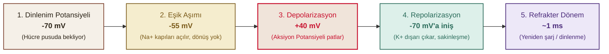
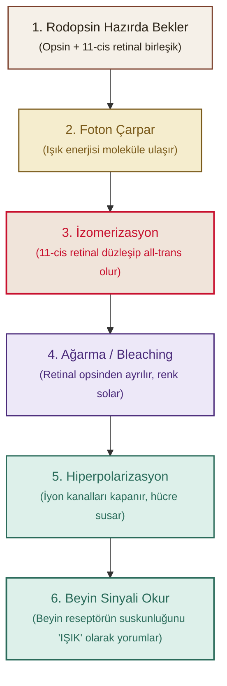

## İçindekiler

- [[#Algı Psikolojisi: Ne Gördüğümüzü Nereden Biliyoruz?]]
- [[#1. Işık Değil Dalga Boyu — Algının İstatistiki Doğası]]
- [[#2. Uzun İnce Bir Yol — Çevreden Eyleme 7 Durak]]
- [[#3. Psikofizik: Algıyı Ölçmek]]
  - [[#Mutlak Eşik]]
  - [[#Fark Eşiği ve Weber Kanunu]]
  - [[#Fechner'in 3 Klasik Eşik Metodu]]
  - [[#Stevens'ın Güç Yasası — Sıkışma ve Patlama]]
- [[#4. Sinyal Algılama Kuramı (SDT) — Kulak vs. Karakter]]
  - [[#Duşta Çalan Telefon Analojisi (Kevser vs. Mülayim)]]
  - [[#2x2 Karar Matrisi ve Karakter Düellosu]]
- [[#5. Duyu Fizyolojisi — Nöron Doktrini ve Aksiyon Potansiyeli]]
  - [[#Cajal ve Nöron Doktrini]]
  - [[#Aksiyon Potansiyeli ve İyonik Fedai Pompası]]
  - [[#Değişmez 3 Kıstas: Ya Hep Ya Hiç, Refrakter Süre ve Frekans Kodlaması]]
  - [[#Sinapslar: Gaz (EPSP), Fren (IPSP) ve Halat Çekme Savaşı]]
- [[#6. Gözün Optiği — Biyolojik Fotoğraf Makinesi ve Kırma Kusurları]]
  - [[#Larry Hester ve Görünür Spektrum]]
  - [[#Gözün Yapısı: Kornea (%80) vs. Lens (%20)]]
  - [[#Odaklanma ve Presbiyopi: Lensin Emekliliği]]
  - [[#Kırma Kusurları ve Beynin Photoshop Mesaisi]]
  - [[#Kısa Exkurs: Gerçeklik Gerçekten Bulanık Olamaz mı?]]
- [[#7. Retina: Işığın Aydınlattığı Mahalle]]
  - [[#Fototransdüksiyon: Kimyasal Ateşleme]]
  - [[#Karanlık Adaptasyonu ve Kohlrausch Kırılması]]
  - [[#Alacakaranlıkta Renklerin İhaneti: Purkinje Kayması]]
  - [[#Fedakârlık vs. Zekâ: Konverjans (120:1 vs. 1:1)]]
  - [[#Yanal Engelleme: Mahalle Baskısı ve Limulus]]
  - [[#Yanal Engellemenin Çöktüğü An: Hermann, Benary ve White İllüzyonları]]
- [[#Kavramlar ve Kelimeler]]
- [[#Kaynaklar]]

---

## Algı Psikolojisi: Ne Gördüğümüzü Nereden Biliyoruz?

Algı Psikolojisi...

Ne gördüğümüzü nereden biliyoruz?

Ya da gördüğümüz şeyin gerçekten de "gördüğümüz şey" olduğunu?

> [!quote] Kurt Koffka (1886 – 1941)
> *"Why do things look as they do?"*

Gördüklerimizin nasıl oluyor da gördüğümüz gibi göründüğünü de içine alan geniş bir konu, algı psikolojisi.

New York Times'ın Temmuz '58 sayısında "Elektronik Beyin Kendi Kendine Öğreniyor" isminde ilginç bir makale yayınlanmış.

Makalede bahsedilen şey, yeni ve devrim potansiyelinde bir teknolojik gelişme: Perceptron[^perceptron] adında elektronik bir bilgisayar. Yaklaşık 1 yıl içinde tamamlandığında, insan eğitimi veya denetimi olmadan, çevresini algılayabilen, tanıyabilen ve tanımlayabilen ilk cansız mekanizma olması beklenmektedir...


İlk Perceptron'u yapan psikolog Frank Rosenblatt (1958). Oda boyutunda, tam beş ton ağırlığında bir makine düşün..
Kendi kendine öğreniyor: solda işaret olan kart mı, sağda işaret olan kart mı, ayırt edebiliyor. Henüz o kadar oluyor..
Rosenblatt diyor ki bu cihaz “optik, elektriksel ya da tonal bilgi örüntüleri arasındaki benzerlikleri veya özdeşlikleri, biyolojik bir beynin algısal süreçlerine bayağı benzer şekilde tanımayı öğrenebilir”.
Yani adam resmen **"bu makine beyin gibi algılayacak"** diyor. Üstelik Rosenblatt ve o dönemin bilgisayarcıları, Perceptron gibi bir "algılayan makineyi" yapmak için on yıl falan yeterli diyorlar, biraz iyimserler. Yani *insan gibi* çevreyi kolaylıkla anlayabilen ve içinde hareket edebilen bir makine on yıla hazır olur diye düşünüyorlar.

Açık konuşmak gerekirse Rosenblatt'ın Perceptron'u insan algısını taklit etmekte pek de başarılı olamadı.

O beş tonluk Perceptron: solda mı sağda mı işaret var, onu bile **50** denemede/turda öğreniyordu. Bugünden bakınca komik geliyor, çünkü artık telefonundaki bir uygulama saniyeler içinde yüz tanıyor, sahne anlatıyor, hatta video izliyor/yaratıyor. 
Rosenblatt'ın "makine algılayabilir" fikri ==bugünkü yapay zekânın ve özellikle derin öğrenmenin (deep learning) öncüsü/ilk adımı== sayılıyor ve kimse bunu tartışmıyor.

Ama işin *ilginç* tarafı şu: Aradan neredeyse 70 yıl geçti, sistemler inanılmaz hale geldi ama "insan gibi algılama" konusunda **net** bir cevap yok..

2020'lerin ortasında görsel-dil modelleri fotoğrafa bakıp yalnızca "pistte uçak var" demiyor; hava gösterisi olduğunu, insanların ziyaretçi olduğunu, *hatta* fotoğrafın duygusal tonunu bile söyleyebiliyor.
**Ama bu, "algı" denen şeyin birebir aynısı mı?**
*İşte orası hâlâ tartışmalı..*
Çünkü insan algısı *sadece etiketleme değil*; beden, bellek, duygu ve bağlamla iç içe işleyen bir süreç. Bugünün modelleri inanılmaz derecede iyi birer örüntü makinesi ancak bu süreçlerin fenomenolojik olarak insan deneyimiyle aynı doğada olup olmadığı sorusu hâlâ açıktır.

Peki o zaman algı neden bu kadar zor? Neden makineler uzun süre bunu yapamadı? İşte **tam da bu noktada** Koffka'nın sorusuna geri dönüyoruz.

---

## 1. Işık Değil Dalga Boyu — Algının İstatistiki Doğası

Kurt Koffka az önce yazının başında da sorduğumuz o meşhur soruyu sorduğunda... yani: "Neden şeyler göründüğü gibi görünür?" şöyle düşünebiliriz:

Gözünü açıyorsun ve dünyayı görüyorsun: renkler, biçimler, derinlik, hareket. Kulaklarınla sesleri duyuyorsun.
Peki bu deneyimler gerçekten **"dışarıda"** mı?

Fizik açısından bakınca işler tuhaflaşıyor:

* Dış dünyada **renk yok**. Işık var; elektromanyetik spektrumun dar bir dilimi var. "Kırmızı" denen şey, o dalga boyunun beyinde yarattığı bir *deneyim*.
* Dış dünyada **ses de yok**! Havada basınç dalgaları var. "Kuş sesi" dediğimiz şey, o dalgaların kulakta ve beyinde dönüştürülmesiyle ortaya çıkan bir yapı.
* Retina **iki boyutlu** bir yüzey; ama biz dünyayı üç boyutlu görüyoruz. Üstelik retinaya düşen görüntü, dış dünyanın **eksik ve belirsiz** bir izdüşümü. Aynı 2B görüntüyü doğurabilecek sonsuz sayıda 3B düzenleme var.

> [!important] Temel Çıkarım
> ***Yani elimizdeki veri, dış dünyanın birebir kopyası değil; sadece bir ipucu.***

Buna rağmen algımız çoğu zaman gayet net, istikrarlı ve *"gerçek"* hissettiriyor.

İşte paradoks burada:

Dışarıda renk yok, ses yok, üçüncü boyut retinada yok. Ama biz renkli, sesli, derinlikli bir dünyada yaşıyoruz. Bu nasıl oluyor? Beyin **tam** olarak neyin peşinde?

Beyin istatistiksel bir tahmin motorudur.
Duyulardan gelen eksik ve gürültülü sinyalleri *pasif biçimde kaydetmiyor*; aktif olarak yorumluyor, tamamlıyor ve kestiriyor.

Dünyaya dair **önceden öğrenilmiş istatistiksel beklentiler**i kullanıyor.
Gelen duyusal veriyi bu beklentilerle birleştirip **en olası yorum**u üretiyor.
*Yani algı, dış dünyanın bir fotoğrafı değil; beynin "büyük olasılıkla dışarıda olan şey bu" diye kurduğu bir hipotez.*

Gerçeklik algısı, görünen dünya, beynin tahminlerinin sahnelenmesi gibi. Renk de, ses de, derinlik de o sahnenin parçaları.

> [!example] Bağlamın Gücü: B mi, 13 mü?
> Aynı işaret, ortamına göre **"B"** harfi ya da **"13"** sayısı olarak okunuyor. Fiziksel uyaran aynı; değişen tek şey bağlam. Beyin, çevredeki ipuçlarına bakıp "bu büyük olasılıkla bir harf" ya da "bu büyük olasılıkla bir sayı" diye kestirim yapıyor. Gelen veri değişmiyor; ama algı değişiyor. *Yani dışarıda değişen bir şey yok; değişen şey tahminin kendisi.*

---

## 2. Uzun İnce Bir Yol — Çevreden Eyleme 7 Durak

Tamam dışarıda renk yok, ses yok diyoruz. 
Ama bir ağaç var. Peki o ağaç, kafamın içindeki "ağaç" deneyimine nasıl dönüşüyor?

Bunu anlamak için (Âşık Veysel'e de saygılar) uzun ince bir yol var. 
Bu yolun başında dışarıdaki uyarıcı duruyor (ağaç, kuş sesi, benzin kokusu). 
Yolun sonunda ise bizim o uyarıcıyı algılamamız, tanımamız ve bir aksiyon almamız var (ağaca dönüp bakmamız gibi).

Bu yolda 7 durak var ama panik yok, şimdilik sadece rotayı çiziyorum:

```mermaid
flowchart LR
    A["1. Çevresel Uyarıcı<br><small>(Ortamdaki Enerji / Işık)</small>"] --> B["2. Temsili Uyarıcı<br><small>(Retinadaki 2B Kesit)</small>"]
    B --> C["3. Transdüksiyon<br><small>(Kimyasaldan Elektriğe)</small>"]
    C --> D["4. Nöral İşleme<br><small>(Kortekse Yolculuk)</small>"]
    D --> E["5. Algı<br><small>('Bir şey görüyorum!')</small>"]
    E --> F["6. Tanıma<br><small>('Bu bir ağaç...')</small>"]
    F --> G["7. Eylem / Aksiyon<br><small>(Yakından bakmaya gitmek)</small>"]

    style A fill:#f5f0e8,stroke:#7a3e2a,stroke-width:1.5px,color:#2c2418
    style B fill:#f5f0e8,stroke:#7a3e2a,stroke-width:1.5px,color:#2c2418
    style C fill:#f0e4da,stroke:#7a3e2a,stroke-width:2px,color:#7a3e2a
    style D fill:#f5f0e8,stroke:#7a3e2a,stroke-width:1.5px,color:#2c2418
    style E fill:#ddf0ea,stroke:#2a6b5a,stroke-width:1.5px,color:#2a6b5a
    style F fill:#ddf0ea,stroke:#2a6b5a,stroke-width:1.5px,color:#2a6b5a
    style G fill:#f5edce,stroke:#7a5a1a,stroke-width:1.5px,color:#7a5a1a
```



1. **Dışarıda bir şeyler oluyor (*Çevresel Uyarıcı*):** Ortamda bir enerji var. Ağacın yansıttığı ışık.
2. **Işık göze çarpıyor (*Temsili Uyarıcı*):** O koca dünyadan sadece bir kesit, gözün merceğinden geçip retinaya düşüyor. Yani dünyanın 2 boyutlu, **eksik** bir fotoğrafı çekiliyor.
3. **Reseptörler devrede (*Transdüksiyon*):** Retinadaki çubuk ve koniler, bu ışık enerjisini alıp **elektrik sinyaline çeviriyor**. ==Dışarıdaki fizik burada bitiyor, artık her şey vücudun içinde.==
4. **Sinirlerde yolculuk (*Nöral İşleme*):** Bu elektrik sinyali, bir uçtan diğerine, milyonlarca nöronun arasından geçerek beynin görme bölgesine doğru yola çıkıyor.
5. **Perde açılıyor (*Algı*):** Beyin, gelen bu elektrik sinyallerini alıp işliyor ve bilinçli bir deneyim yaratıyor. **"Bir şey görüyorum!!"**
6. **Etiketleniyor (*Tanıma*):** Beyin veri tabanını karıştırıyor ve diyor ki *"Bu gördüğün şey bir ağaç..."*
7. **Harekete geçiyoruz (*Aksiyon*):** "Aa aslında güzel ağaçmış, gidip yakından bakayım bari.." deyip yürüyoruz.

---

## 3. Psikofizik: Algıyı Ölçmek

Görüyoruz ki algı dediğimiz şey, beynin dışarıdan gelen eksik veriyi kullanarak "büyük olasılıkla şu var" demesi. 
Peki bu **"var"** deme işi ne zaman başlıyor? 
Hangi uyarıcılar fark ediliyor, hangileri edilmiyor? Ve benzer soruların peşine düşen bilim dalıdır psikofizik[^psikofizik]. 
Psikofizik, fiziksel *dünya ile zihinsel deneyim* arasındaki ilişkiyi sayılarla ölçmeye çalışıyor.

Peki, ilk ölçülecek şey ne? 

### Mutlak Eşik

"Var" demenin sınırına mutlak eşik deniyor. 
Bir uyarıcının varlığını fark edebildiğin *en düşük enerji* seviyesi.

Dışarıda bir uyarıcı var. Ama ne kadar güçlü olursa olsun, her zaman algılanmıyor. Karanlık bir odada çok soluk bir ışık var; görür müsün? Görmeyebilirsin. Peki ışığı yavaş yavaş artırdık, artırdık, artırdık... Bi noktada "Aa, orada bir şey var!" diyorsun.

İşte **o** noktaya mutlak eşik diyoruz. 

Ama burada ince bir detay var: Mutlak eşik = "her zaman fark ettiğin nokta" değildir. "Denemelerin yarısında fark ettiğin nokta" diyoruz. Yani %50.

Neden? Çünkü vücut gürültülü bir makine gibi. Dışarıdan gelen sinyallerin bir kısmı zaten gürültüye karışıyor; bir kısmı da kendisi gürültü zaten. 
Aynı uyarıcıyı bir denemede fark edersin, bir sonrakinde fark etmezsin. Sistem stabil değil. O yüzden %50 kuralı bir filtre gibi çalışıyor: "Bu noktada artık şans eseri değil, gerçekten algılamaya başladın" diyoruz.

### Fark Eşiği ve Weber Kanunu

Mutlak eşik **"var mı yok mu?"** sorusunun cevabıydı. Ama bir de işin şu kısmı var: **"Değişti mi?"**

Elimde 100 gram un var. Gözler kapalı. Birisi elime 2 gram daha koydu. Hissettim mi? Muhtemelen hayır. 
Peki 5 gram? Belki. 8 gram? Evet, bir şeyler değişti galiba...

İşte bu "farkı hissettiğin en küçük değişim" miktarına Fark Eşiği deniyor. Yani JND[^jnd]: Just Noticeable Difference, tam çevirisiyle: "anca fark edilebilen fark."

Buraya kadar her şey normal. Sonra Weber çıkıp diyor ki:
> **"Önemli olan ne kadar eklediğin değil; oran."**

Fiziksel değişimlerin mutlak değil, oransal olarak algılandığını söyler. Yani uyarıcının şiddetindeki artış miktarının farkedilebilmesi, uyarıcının şiddetiyle orantılıdır. 

Şöyle düşünelim:
Elinde yine 100 gram un var. 1 gram eklediler. Fark etmedin. Ama bir noktada fark etmeye başlıyorsun, diyelim ki 102 gramda. Yani **fark eşiği** 2 gram.
Şimdi elinde 200 gram var. Acaba yine 2 gram mı eklersek fark edersin? Hayır. Bu sefer 4 gram eklemek gerekiyor.
İkisinde de oran %2. Yani fark eşiği, başlangıçtaki ağırlığın %2'si kadar. 100'de 2, 200'de 4, 500'de 10...
Ve bu farkları farketmemizi sağlayacak olan eşit sabit bir şekilde oranlı.. 

Weber tüm bunu şu formülle açıklıyor: 

$$\frac{\Delta S}{S} = k$$

* **$\Delta S$:** Fark eşiği (hissedebildiğin en küçük değişim)
* **$S$:** Başlangıçtaki uyarıcı şiddeti
* **$k$:** Sabit oran (her duyu için farklı Weber kesri)

Ve bu oran her duyuda başka:

| Duyu Alanı | Weber Oranı ($k$) | Duyarlılık Seviyesi | Pratikteki Karşılığı |
| :--- | :--- | :--- | :--- |
| ⚡ **Elektrik Şoku** | **~%1** | 🔴 En Yüksek | Akımdaki milim fark anında yakalanır |
| ⚖️ **Ağırlık** | **~%2** | 🟡 Yüksek | 100 gramda 2g, 200 gramda 4g fark gerekir |
| 🔊 **Ses Şiddeti** | **~%4** | 🟢 Orta | Tonal değişimlerde orta düzey duyarlılık |
| 💡 **Işık Parlaklığı** | **~%8** | 🔵 Geniş Aralık | 100 lümense 8 lümen eklemek gerekir |
| 🧂 **Tat (Tuzluluk)** | **~%8** | 🟣 Yüksek Tolerans | Geniş adaptasyon aralığı nedeniyle tolerans yüksektir |

Elektrik şoku en hassas duyu: %1'lik bir akım farkı bile algılanıyor. Yani neredeyse "milim milim" hissedeceksin. Vücut şoka karşı aşırı duyarlı.

Ağırlık için %2'lik fark yeterli.
Ses için %4, ışık ve tat için %8'lik fark gerekiyor. Yani ışık değişimini fark etmek daha zor, çünkü göz zaten çok geniş bir aralıkta çalışıyor; küçük farklara "göz yumuyor".

Bu yüzden Weber'in dediği: Duyular dünyayı mutlak değil, oransal tartıyor.

---

### Fechner'in 3 Klasik Eşik Metodu

Ama bi durup düşünelim: Bu adamlar 1800'lerde yaşıyor. Ve o dönemin genel kanısı şu: **Zihin ölçülemez..** Sebebi de basit: Beden fizikseldir, dokunursun, ölçersin. Ama zihin öyle mi? Görünmez, soyut. Hatta o dönemde "zihnin kendini incelemesi imkansızdır" diye bir inanç var. Yani *"Beyin kendini nasıl anlasın ki?"* gibi bir paradoks.

22 Ekim 1850 sabahı, Leipzig Üniversitesi fizik profesörü Gustav Fechner yatağında yatarken birden aklına şöyle bir şey geliyor: "Ulan hadi aslında zihin ve beden iki ayrı şey değil de, aynı gerçekliğin iki yüzüyse!?"

Yani: Fiziksel bir uyarıcıyı artırırsan (mesela ışığı açarsan), insanın deneyimi de artıyor (daha parlak görüyorsun). O zaman bu ikisi arasındaki ilişkiyi ölçebilirsen, zihni de ölçmüş olursun.

O dönem için epey devrimsel bir fikir bu. Fechner yaklaşık bi 10 yıl bu fikri rafine ediyor ve en son "Elemente der Psychophysik" (Psikofiziğin Öğeleri) isimli başyapıtını yayınlıyor.. Bu kitap aynı zamanda da ampirik (bilimsel) psikolojinin de temel taşlarındandır. 

"Peki bu eşikler nasıl ölçülüyor? Adamlar laboratuvara girip ne yapıyor?"

Fechner eşiği ölçmek için 3 klasik yöntem öneriyor:

::: columns-3
#### 🎚️ 1. Sınır Yöntemi *(Limits)*
Deneği karşına oturttun.. Elinde bir ses düğmesi var. Sesi en kısıktan başlatıp yavaş yavaş artırıyorsun. Denek *"duydum!!"* dediği anda duruyorsun. Sonra yüksek sesten kısıyorsun, *"duyamıyorum.."* dediği yeri not alıyorsun.
Ortaya çıkan geçiş noktalarının ortalaması alınır.

* **🎯 Artısı:** Hızlı ve pratik.
* **⚠️ Eksisi:** Alışkanlık hatası (ezbere cevap).

---

#### 🎛️ 2. Ayarlama Yöntemi *(Adjustment)*
Bu sefer düğme deneğin elinde. *"Sesi kendin ayarlasana.. Tam duyulur-duyulmaz sınırına getir"* diyorsun. Denek potansiyometreyi kendi kendine çevirip tam sınıra getirir.

* **🎯 Artısı:** Çok hızlı, denek aktif katılır.
* **⚠️ Eksisi:** Kaba ölçüm; denekten deneğe ve ana göre çok oynar.

---

#### 📊 3. Sabit Uyarıcılar *(Constant)*
Önceden belirlenmiş 5-9 farklı şiddette uyarıcı rastgele sırayla defalarca verilir. Denek her seferinde "duydum / duymadım" der.
Grafikteki **psikometrik eğride %50 noktası** eşik kabul edilir.

* **🎯 Artısı:** En güvenilir altın standart.
* **⚠️ Eksisi:** Uzun sürer, denek yorulur.
:::

---

### Stevens'ın Güç Yasası — Sıkışma ve Patlama

Gördüğümüz üzere Weber ve Fechner hep "fark ettin mi, etmedin mi?" diye sordu. Yani hep eşiklerle uğraştılar.

Ama Stevens dedi ki: "Ya eşik tamam da... bir de şu var: Bu uyarıcılar ne kadar güçlü *hissettiriyor*?"

Çünkü gerçek hayatta algı, fiziksel değerlerle birebir *gitmiyor*. Beyin bazen sansürlüyor, bazen de abartıyor, uyduruyor:

$$P = k \cdot S^n$$

```
   Algılanan Şiddet (P)
        ▲
        │       /  [Elektrik Şoku: n > 1] -> DUYUSAL PATLAMA (Response Expansion)
        │      /
        │     /   [Çizgi Uzunluğu: n = 1] -> BİREBİR DOĞRUSAL
        │    /
        │   /─────── [Parlaklık/Ses: n < 1] -> DUYUSAL SIKIŞMA (Response Compression)
        │  /
        └──────────────────────────► Fiziksel Şiddet (S)
```

::: columns-2
#### 📉 Duyusal Sıkışma ($n < 1$)
Telefonun parlaklık ayarı mesela. Parlaklığı %0'dan %10'a çıkarsan *"Vaaay, gözüm açıldı!"* dersin. Büyük bir fark.
Sonra %90'dan %100'e çıkardın. Ne hissettin? Neredeyse hiçbir şey..

Fiziksel olarak ikisinde de aynı miktarda ışık artışı var. Ama beynin sana oyun oynuyor: *"Bu kadar ışık yeter ya.. Ben zaten aydınlıktayım kardeşim, bu kadar detaya ne gerek var.."* diyor ve algıyı kısıyor.

**Dünyada ne kadar çok uyarıcı varsa, beyin orada frene basıyor.** Çünkü zaten yeteri kadar bilgi var; her artışı tek tek inceleyip işlemek boşa enerji.

---

#### 📈 Duyusal Patlama ($n > 1$)
Şimdi parmağını 1 voltluk bir şoka ver. *"Aah!"* dersin. 2 volt yaptılar. *"AAAAH!"*

Aradaki fiziksel fark sadece 1 volt. Hissettiğin acı 2 kat değil, neredeyse 100 kat.
Çünkü vücut: *"Şok tehlikelidir, ölüm getirir, ben de katiyen ölmek istemem! En ufak artışta bile alarmı son ses çal! Bağır, çığlık at!"*

İşte buna da duyusal patlama deniyor. Beyin burada frene değil, gaza basıyor. **Çünkü hayat kurtarması lazım.**
:::

---

## 4. Sinyal Algılama Kuramı (SDT) — Kulak vs. Karakter

Duyu sistemimiz sessiz bir odada çalışmıyor. Hep bir gürültü var. Vücudun içindeki gürültü, dışarıdaki gürültü, gözünün önünde uçuşan cisimler... Ama sen bu gürültünün içinden gerçek bir sinyali seçmek zorundasın.

Klasik psikofizik der ki: "Eşik var, bu eşiği geçince duyarsın, geçmeyince duymazsın."

Ama Sinyal Algılama Kuramı[^sdt] (SDT) der ki: "Bi dakika kardeşim.. Bu işler bu kadar mekanik değil. Algı, sadece duyu organının hassasiyeti değil; aynı zamanda kişinin karar verme **tarzıdır**."

Yani "duydun mu?" sorusu aslında iki ayrı şeyi birden içeriyor:

1. **Duyarlılık / Hassasiyet ($d'$):** Kulağın gerçekten ne kadar iyi duyuyor? (Biyolojik kapasite)
2. **Karar Kriteri ($\beta$ / $c$):** "Duydum" demek için ne kadar cesur davranıyorsun? (Kişilik, motivasyon, risk alma)

### Duşta Çalan Telefon Analojisi (Kevser vs. Mülayim)

Duştasın, su şarıl şarıl akıyor. Telefonun diğer odada. Bir ses mi geldi, yoksa suyun sesine mi karıştı?

İki tür karar var:
* **Kevser:** "Bir şey mi çaldı?!" deyip her seferinde sudan fırlayıp koşuyor. Telefon çalmasa bile koşuyor..
* **Mülayim:** "O ses telefondan mı geldi? Neyse, boşver." deyip duşuna devam ediyor.. Bazen telefon çalsa bile duymazdan geliyor.

Sinyal ya var ya yok. Sen de ya "var" dersin ya "yok". Bu dört olasılık doğuruyor:

### 2x2 Karar Matrisi ve Karakter Düellosu

| Karar Matrisi | 🔔 **Sinyal Gerçekten Var** *(Telefon Çaldı)* | 🚿 **Sinyal Yok** *(Sadece Su Sesi / Gürültü)* |
| :--- | :--- | :--- |
| **"Duydum / Var"** | 🟢 **İsabet (Hit)** — *Doğru tespit* | 🔴 **Yanlış Alarm (False Alarm)** — *Yalancı yangın* |
| **"Duymadım / Yok"** | 🔴 **Iska (Miss)** — *Kaçırılan fırsat* | 🟢 **Doğru Ret (Correct Rejection)** — *Temiz eleme* |

::: columns-2
#### 🏃‍♀️ Karakter 1: Kevser (Liberal / Düşük Kriter $\beta$)
* **Telefon çaldığında:** %90 duyuyor (🟢 İsabet Yüksek).
* **Telefon çalmadığında:** %50 "çaldı!" diye fırlıyor (🔴 Yanlış Alarm Yüksek).
* **Profil:** Cesur, tetikte, panik atak sınırında ama çok dikkatsiz. Her çıtırtıya atlar.

---

#### 🧘‍♂️ Karakter 2: Mülayim (Muhafazakâr / Yüksek Kriter $\beta$)
* **Telefon çaldığında:** %60 duyuyor (🟢 İsabet Orta).
* **Telefon çalmadığında:** Sadece %10 "çaldı!" diyor (🟢 Yanlış Alarm Çok Düşük).
* **Profil:** Sakin, temkinli, şüpheci. Gürültüyü sinyalden tertemiz ayıklar.
:::

Peki "duyarlılık" ($d'$) ne demek? Duyarlılık, sinyal varken "var" diyebilme, yokken de "yok" diyebilme kapasitesidir. Yani eğriye eğri, doğruya doğru diyebilmek; Sezar'ın hakkını Sezar'a verebilmektir:

$$\text{Duyarlılık } (d') \approx \text{İsabet Oranı} - \text{Yanlış Alarm Oranı}$$

* **Kevser:** $90 - 50 = \mathbf{40}$
* **Mülayim:** $60 - 10 = \mathbf{50}$

Gördüğümüz üzere Mülayim daha hassas! Mülayim, sinyali gürültüden ayırt etme işini daha temiz yapıyor. Kevser ise her şeye "sinyal!" diyerek yüksek isabet yakalamış gibi gözüküyor ama arka planda yanlış alarm çöplüğü yaratıyor.

> [!summary] Klasik Eşik vs. SDT
> * **Klasik eşik:** "Duyarsan algılarsın, duymazsan algılamazsın." (Mekanik yaklaşım)
> * **SDT:** "Duyarsın ama 'duydum' demek bir **karardır**. O karar da kişiliğine ve bağlama göre değişir." (Psikolojik yaklaşım)

---

## 5. Duyu Fizyolojisi — Nöron Doktrini ve Aksiyon Potansiyeli

Pekii... Kafanın içinde ne oluyor? Tamam, algıyı ölçtük, kararı verdik, "Aa, bir şey **var!**" dedik.. O anda beyinde nasıl bi fırtına kopuyor?

Buradan sonra işin içine ==elektrik== giriyor. 
***Çünkü algı denilen şey, özünde bir elektrik sinyali meselesidir.***
Beynin ***dili*** elektriktir. 
Dışarıdan gelen ışık, ses, basınç... Bunların hepsi vücudun içine girdiği anda elektrik sinyaline çevriliyor. 
Şimdi bu elektrik tesisatına göz atmak **zorundayız**.

### Cajal ve Nöron Doktrini

Eskiden beynin balık ağı gibi birbirine geçmiş **tek** bir dev ağ olduğunu sanılıyordu. Yani "her şey her şeye bağlı, böylece akıyor" gibi düşünüyorlardı.

Sonra Santiago Ramón y Cajal çıkageldi.. Mikroskopla baktı ve dedi ki:

> "Hayır!! Bunlar ayrı ayrı hücreler. Aralarında minicik boşluklar var!"

İşte buna Nöron Doktrini[^noron-doktrini] diyoruz. Yani beyin, birbirine **değmeyen** milyarlarca ayrı hücreden oluşuyor. **Her biri ayrı bir birey gibi.** Aralarındaki boşluk ise sinaps.

Bu keşif o kadar önemli ki, Cajal 1906'da Nobel alıyor. Çünkü bu, beynin **nasıl iletişim kurduğu**nu anlamanın kapısını açıyor.

### Aksiyon Potansiyeli ve İyonik Fedai Pompası

**Peki bu ayrı ayrı nöronlar nasıl konuşuyor?**
*Aksiyon potansiyeli denilen bir elektrik patlamasıyla.*

Hücre dediğimiz şey, dışarıyla sürekli alışveriş yapan bir **fabrika**. Dışarıda da içeride de iyonlar var, yani elektrik yüklü atomlar. 
Nöronun içinde de bir elektrik gerilimi var. Dinlenirken bu değer **-70 milivolt (mV)** civarında. Yani hücre "pusu" modunda.
Nöron dinlenirken aslında "uyumuyor", sürekli enerji depoluyor. Tıpkı yayı gergin tutulan bir ok gibi, pusuya yatmış fırsat kolluyor. -70 mV işte o yayın gergin halidir, pusuda olma durumudur. 

Dışarıda bir sürü Sodyum ($\text{Na}^+$) var. İçeride de bir sürü Potasyum ($\text{K}^+$) var. İkisi de pozitif yüklü. Ama burada bir dengesizlik var; dışarısı daha pozitif, içerisi daha negatif.

> [!abstract] Sodyum-Potasyum Pompası (Kulüp Fedaisi)
> Bu protein zorla **3 tane Sodyum'u dışarı** atıyor, **2 tane Potasyum'u içeri** alıyor.
> Bildiğin bir fedai gibi: Club'ın kapısında duruyor, VIP üyeleri içeri alıyor, kavga çıkaran hanzoları dışarı atıyor. Ama bunu bedava yapmıyor; maaşını (ATP) alıyor, ona göre çalışıyor.



* **Dinlenim (-70 mV):** Yatıyorum, bana bulaşma...
* **Eşik Aşımı (-55 mV):** Artık dönüş yok. "Tamam! Dayanamıyorum!!"
* **Ateşleme / Depolarizasyon (+40 mV):** Voltaj tepeye fırlıyor. İşte bu fırlamaya ==Aksiyon Potansiyeli== deniyor.
* **Sakinleşme / Repolarizasyon:** Potasyum ($\text{K}^+$) dışarı çıkıyor, hücre **tekrar -70 mV**'a dönüyor.

---

### Değişmez 3 Kıstas: Ya Hep Ya Hiç, Refrakter Süre ve Frekans Kodlaması

::: columns-3
#### 🔫 1. Ya Hep, Ya Hiç!
Nöron ya ateşlenir ya ateşlenmez. Arada bir şey yok. "Azıcık ateşleneyim şuracıkta.." diye bir şey YOK. 

Tabanca tetiği gibidir: Çektiğin an TAK! Uyarıcı eşiği geçtiyse **tam güçle** ateşlenir, geçmediyse hiçbir şey olmaz.

---

#### ⏳ 2. Refrakter Süre
Nöron ateşlendiğinde hemen tekrar ateşlenemez. Bi nefes alması, kendine gelmesi lazım... Ejakülasyon sonrası gibi. Bir kez boşalım oldu mu, sistemin toparlanması için zamana ihtiyacı vardır.

Bu bekleme süresi **~1 milisaniyedir**. Ateşleme hızının üst limiti vardır.

---

#### 🥁 3. Frekans Kodlaması
Her aksiyon potansiyeli aynı boydadır (+40 mV). Peki beyin şiddeti nasıl anlar? Voltajla değil, **ateşleme sıklığıyla**.

Elektronik bateri gibi:
* Şarkı sakinse: Davulcu ağır ağır çalar *(tık... tık...)*
* Şarkı coşuyorsa: Deli gibi çalar *(TAK TAK TAK TAK!)*
:::

---

### Sinapslar: Gaz (EPSP), Fren (IPSP) ve Halat Çekme Savaşı

Nöronlar birbirine değmiyorsa elektrik nasıl karşıya geçiyor?

Elektrik boşluktan atlayamayacağı için, beyin *elektrik sinyalini* **kimyasal sinyale çeviriyor.** 
Hücrenin içindeki kesecikler patlar, nörotransmitterler sinaps boşluğuna dökülür ve karşı nöronun kapısını çalar:

::: columns-2
#### 🟢 EPSP (Eksitatör Potansiyel) — "BAS GAZA!"
* $\text{Na}^+$ iyon kapılarını açar.
* Hücrenin voltajını yükseltir (-70'ten -65 mV'a).
* Hücreyi ateşleme eşiğine (-55 mV) bir adım daha yaklaştırır.

---

#### 🔴 IPSP (İnhibitör Potansiyel) — "FRENE BAS!"
* $\text{Cl}^-$ veya $\text{K}^+$ kapılarını açar.
* Hücrenin içini daha negatif yapar (-70'ten -75 mV'a).
* Hücreyi eşikten uzaklaştırıp sükûnete çağırır.
:::

> [!important] Beynin Karar Anı: Büyük Toplama (Summation)
> Bir nöronun üzerinde binlerce sinaps var. Bir sürü EPSP (gaz) ve bir sürü IPSP (fren) **aynı anda gelir.**
> 
> $$\text{Net Voltaj} = \sum \text{EPSP} - \sum \text{IPSP}$$
> 
> Net sonuç hücreyi **-55 mV eşiğine** ulaştıracak kadar pozitifse: **ATEŞLE!** Ulaşamıyorsa: Sessizlik...

---

## 6. Gözün Optiği — Biyolojik Fotoğraf Makinesi ve Kırma Kusurları

Nöronlar davulcu gibi çalıyor, sinapslar gaz-fren yapıyor. Ama bu elektrik fırtınasını başlatan neydi? Işık.

### Larry Hester ve Görünür Spektrum

Larry Hester, 30'lu yaşlarında *Retinitis pigmentosa* nedeniyle tamamen kör olan ve 33 yıl karanlıkta yaşadıktan sonra biyonik gözle tekrar ışığı gören emekli bir lastik satıcısı. Larry diyor ki: *"Işık o kadar basit ki, kimse için bir anlam ifade etmez. Ama benim için 'görebiliyorum' demek."*

İnsanın görebildiği aralık elektromanyetik spektrumun yalnızca **400–700 nanometre (nm)** arasıdır:
* **Kısa dalga boyu (~400-450 nm):** Mavi
* **Orta dalga boyu (~500-550 nm):** Yeşil
* **Uzun dalga boyu (~650-700 nm):** Sarı, turuncu ve kırmızı

---

### Gözün Yapısı: Kornea (%80) vs. Lens (%20)

::: columns-2
#### 🛡️ Kornea (%80 Sabit Güç)
* Gözün en dışındaki saydam kubbe.
* Kırma gücünün %80'ini tek başına halleder.
* Sabittir, kavisi değişmez, tam bir kaba iş makinesidir.

---

#### 🎯 Lens (%20 Dinamik İnce Ayar)
* Siliyer kaslarla incelip kalınlaşır.
* Mesafeye göre odaklama yapar (**akomodasyon**[^akomodasyon]).
* Otomatik odaklama jimnastikçisidir.
:::

---

### Odaklanma ve Presbiyopi: Lensin Emekliliği

Gençken lens jimnastikçi gibidir, esnektir. Yaşlandıkça sertleşir ve elastikiyetini kaybeder. Sonuç: Presbiyopi[^presbiyopi] (Babanne gözlüğü). *Nahpunkt* (yakın nokta) yani en net görebildiğin minimum mesafe yaşla birlikte gözden kaçar.

---

### Kırma Kusurları ve Beynin Photoshop Mesaisi

::: columns-2
#### 👓 Miyopi (Uzağı Görememe)
* **Sebep:** Göz küresi fazla uzun veya kornea fazla bombeli.
* **Optik:** Işık retinanın **önünde** odaklanır.
* **Sonuç:** Uzaktaki nesneler retinaya dağılarak bulanık düşer.

---

#### 📖 Hipermetropi (Yakını Görememe)
* **Sebep:** Göz küresi kısa veya kornea düz.
* **Optik:** Işık retinanın **arkasında** odaklanır.
* **Sonuç:** Yakına bakarken lens sürekli kasılır, göz ve baş ağrısı yapar.
:::

Beyin, retinaya düşen bulanık görüntüyü düzeltmek için Photoshop filtreleri gibi boşlukları tahminle doldurmaya çalışır. Ancak bu "photoshop mesaisi" bir süre sonra kafa yorgunluğu ve migren olarak geri döner.

> [!note] Exkurs: Gerçeklik Gerçekten Bulanık Olamaz mı?
> Fizikte "bulanıklık" diye bir şey yoktur; fizik sadece foton dağılımını bilir. Bulanıklık beynin bir alarmıdır. Beyin evrimsel olarak **kontrasta ve keskin sınırlara** âşıktır. Çünkü avcının silüeti ancak keskin kenarla fark edilir. Kenar kaybolduğunda beyin arşivindeki net şablonla uyuşmazlık yaşar ve alarm verir: *Bulanıklık.*

---

## 7. Retina: Işığın Aydınlattığı Mahalle

Retina gözün sensörü değil; **aslında beynin kafatasından dışarıya uzanan canlı bir parçasıdır!**

### Fototransdüksiyon: Kimyasal Ateşleme

Işığın elektriğe dönüştürülmesine fototransdüksiyon[^fototransduksiyon] denir. Çubuklardaki **rodopsin** molekülü, **opsin** (protein) ve **11-cis retinal** (A vitamini türevi) ikilisinden oluşur.



Fotoreseptörler karanlıkta sürekli "karanlık var!" diye bağırır. Işık çarptığında **susarlar (hiperpolarize olurlar)**. Beyin bu sessizliği "ışık" olarak okur!

---

### Karanlık Adaptasyonu ve Kohlrausch Kırılması

Karanlık bir odaya girdiğinde rodopsin depoları yavaşça dolar (tam şarj ~30 dakika sürer):


1. **İlk 5–7 dakika:** Koniler hızla adapte olur ve platoya ulaşır.
2. **7. Dakika (Kohlrausch Kırılması[^kohlrausch-kirilmasi]):** Çubuklar kontrolü ele alır; ışık hassasiyeti binlerce kat fırlar!
3. **20–30 dakika:** Çubuklar tek bir fotonu bile yakalayacak hassasiyete ulaşır.

> [!tip] Korsan Göz Bandı Hack'i
> Korsanların tek gözünü kapalı tutmasının sebebi körlük değil; güverte altına indiklerinde bandı kaldırıp o gözün dolu rodopsin depolarıyla karanlıkta anında görebilmektir.

---

### Alacakaranlıkta Renklerin İhaneti: Purkinje Kayması

Akşam alacakaranlıkta kırmızı güller siyaha dönerken, mavi ortancalar parlar. Bu fenomene Purkinje kayması[^purkinje-kaymasi] denir:


* **Gündüz (Koniler):** 555 nm (sarı-yeşil) tepe duyarlılık $\rightarrow$ Kırmızı çok parlak görünür.
* **Gece (Çubuklar):** 500 nm (mavi-yeşil) tepe duyarlılık $\rightarrow$ Kırmızı körleşir, mavi parlar.

---

### Fedakârlık vs. Zekâ: Konverjans (120:1 vs. 1:1)

Retinada 126 milyon fotoreseptör vardır ama optik sinirden sadece 1 milyon kablo çıkar. Bu sıkışıklık konverjans ile çözülür:

::: columns-2
#### 🌌 Çubuklar (120:1 Konverjans)
* **Miktar:** ~120 Milyon (Periferde yoğun).
* **Bağlantı:** 120 çubuk $\rightarrow$ 1 Ganglion hücresi.
* **Avantaj:** Yüksek ışık hassasiyeti (Gece görüşü).
* **Dezavantaj:** Düşük keskinlik (Detaylar bulanık).
* *"Birlikten kuvvet doğar!"*

---

#### 🎯 Koniler (1:1 Fovea Bağlantısı)
* **Miktar:** ~6 Milyon (Foveada yoğun).
* **Bağlantı:** 1 koni $\rightarrow$ 1 Ganglion hücresi.
* **Avantaj:** Yüksek keskinlik ve renkli görüş.
* **Dezavantaj:** Düşük ışık hassasiyeti (Loşta çalışmaz).
* *"Detay her şeydir!"*
:::

> [!example] Gece Yıldızı Paradoksu
> Gökyüzündeki sönük bir yıldıza doğrudan baktığında yıldız kaybolur (foveadaki 1:1 koniler yetersiz kalır). Gözünü hafif yana kaydırdığında yıldız tekrar belirir (periferdeki 120:1 çubuklar ışığı toplayıp ateşler).

---

### Yanal Engelleme: Mahalle Baskısı ve Limulus

Retinadaki nöronlar birbirini bastırarak kenar ve kontrastı keskinleştirir. Buna yanal engelleme[^yanal-engelleme] denir. Kural basittir: **"Ben parlarım, sen sönersin!"**


Haldan Keffer Hartline (1956), Limulus'un ommatidia birimlerini uyarırken komşu birimlere ışık verdiğinde merkezdeki hücrenin ateşlemesinin **azaldığını** ispatladı. İnsan retinasında bu baskıyı **horizontal** ve **amakrin** hücreler yönetir.

---

### Yanal Engellemenin Çöktüğü An: Hermann, Benary ve White İllüzyonları

Yanal engelleme klasik kontrastları açıklar ama insan beyni sadece yerel pikselleri toplayan aptal bir devre değildir.

::: columns-3
#### 🔲 Hermann Izgarası

Kesişim noktaları 4 koldan yanal baskı aldığı için beyaz yollardan daha karanlık algılanır ve gri noktalar peydah olur.

---

#### ✝️ Benary Haçı

A ve B üçgenleri **özdeş gridir** ve eşit yanal baskı alır. Ama A siyah haçın parçası sayıldığı için B'den daha açık görünür!

---

#### 🦓 White İllüzyonu

Yanal engelleme teorisine göre B daha açık olmalıydı; oysa **A daha açık görünür!** Beyin Gestalt aitlik kurallarını işletir.
:::

Bu üç illüzyon bize şunu gösterir: **Algı retinadaki basit bir yanal engelleme filtresinden ibaret değildir; beynin görsel aitlik, derinlik ve Gestalt örgütleme ilkelerini içeren çok katmanlı bir istatistiksel tahminidir.**

---

## Kavramlar ve Kelimeler

[^perceptron]: **Perceptron** (Frank Rosenblatt, 1958) — Biyolojik sinir ağlarının görsel örüntü tanıma prensiplerini modelleyen ve modern derin öğrenme ile yapay zekânın temelini atan ilk elektromekanik yapay sinir ağı mimarisi.
[^psikofizik]: **Psikofizik** (Psychophysics / Elemente der Psychophysik) — Fiziksel uyaranların ölçülebilir özellikleri ile bunların zihinde yarattığı öznel duyusal deneyimler arasındaki matematiksel ilişkiyi inceleyen deneysel bilim dalı.
[^jnd]: **JND / Fark Eşiği** (Just Noticeable Difference / Unterschiedsschwelle) — Bir kişinin iki uyarıcı arasındaki şiddet farkını denemelerin en az %50'sinde ayırt edebildiği minimum fiziksel değişim miktarı.
[^sdt]: **Sinyal Algılama Kuramı** (Signal Detection Theory / SDT) — Gürültülü arka plan içindeki duyusal tespitlerin sadece biyolojik duyu hassasiyetiyle ($d'$) değil, bireyin beklenti, motivasyon ve risk alma kriteriyle ($\beta$) belirlendiğini kanıtlayan matematiksel karar modeli.
[^noron-doktrini]: **Nöron Doktrini** (Neuron Doctrine / Santiago Ramón y Cajal, 1906) — Beynin tek parça kesintisiz bir ağ (retikulum) değil, aralarında sinaps boşlukları bulunan bağımsız nöron birimlerinden oluştuğunu ortaya koyan modern nörobiyoloji anayasası.
[^akomodasyon]: **Akomodasyon** (Accommodation / Akkommodation) — Siliyer kasların kasılıp gevşeyerek göz merceğinin (lens) kırıcılığını değiştirmesi ve farklı mesafelerdeki nesnelerin görüntüsünü tam retinaya odaklaması süreci.
[^presbiyopi]: **Presbiyopi** (Presbyopia / Yaşa Bağlı Yakın Görme Kaybı) — Yaşlanmayla birlikte göz merceğinin elastikiyetini kaybetmesi sonucu yakın odaklanma noktasının (Nahpunkt) gözden uzaklaşmasıyla karakterize optik kırma kusuru.
[^fototransduksiyon]: **Fototransdüksiyon** (Phototransduction) — Retinadaki çubuk ve koni fotoreseptörlerinde ışık fotonlarının izomerizasyon ve biyokimyasal basamaklar zinciriyle elektriksel membran potansiyeline dönüştürülmesi mekanizması.
[^kohlrausch-kirilmasi]: **Kohlrausch Kırılması** (Kohlrausch-Knick / Rod-Cone Break) — Karanlık adaptasyonu sürecinin yaklaşık 7. dakikasında konilerin maksimum duyarlılığa ulaşıp durduğu ve çubukların kontrolü ele alarak ışık hassasiyetini binlerce kat artırdığı eşik kırılma noktası.
[^purkinje-kaymasi]: **Purkinje Kayması** (Purkinje Shift / Purkinje-Phänomen) — Aydınlıktan alacakaranlığa geçişte fotopik koni görüşünden (555 nm tepe duyarlılık) skotopik çubuk görüşüne (500 nm tepe duyarlılık) geçilmesiyle spektral hassasiyetin mavi-yeşil dalga boylarına doğru kayması.
[^yanal-engelleme]: **Yanal Engelleme** (Lateral Inhibition / Laterale Hemmung) — Uyarılmış bir fotoreseptörün horizontal veya amakrin hücreler aracılığıyla komşu nöronların aktivitesini baskılayarak algılanan görsel sınırlarda kontrastı ve kenar keskinliğini artıran nöral mekanizma.

---

## Kaynaklar

* Benary, W. (1924). Beobachtungen zu einem Experiment über Helligkeitskontrast. *Psychologische Forschung*, 5(1), 131–142.
* Fechner, G. T. (1860). *Elemente der Psychophysik*. Breitkopf und Härtel.
* Goldstein, E. B., & Cacciamani, L. (2021). *Sensation and Perception* (11th ed.). Cengage Learning.
* Green, D. M., & Swets, J. A. (1966). *Signal Detection Theory and Psychophysics*. John Wiley & Sons.
* Hartline, H. K., Wagner, H. G., & Ratliff, F. (1956). Inhibition in the eye of Limulus. *Journal of General Physiology*, 39(5), 651–673.
* Kandel, E. R., Koester, J. D., Mack, S. H., & Siegelbaum, S. A. (2021). *Principles of Neural Science* (6th ed.). McGraw-Hill.
* Koffka, K. (1935). *Principles of Gestalt Psychology*. Harcourt, Brace & Company.
* Ramón y Cajal, S. (1906). The structure and connexions of neurons. *Nobel Lecture*, 12, 220–253.
* Rosenblatt, F. (1958). The perceptron: A probabilistic model for information storage and organization in the brain. *Psychological Review*, 65(6), 386–408.
* Stevens, S. S. (1957). On the psychophysical law. *Psychological Review*, 64(3), 153–181.
* White, M. (1979). A new effect of brightness-luminance contrast. *Perception*, 8(4), 413–416.
