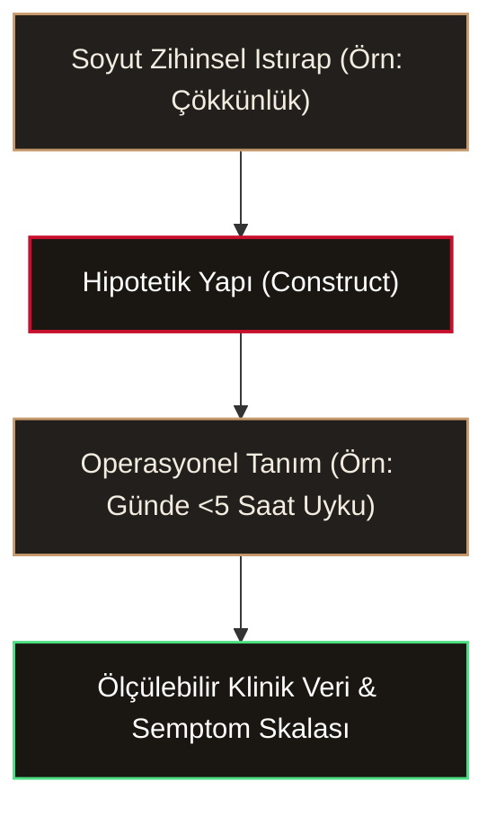

> [!important] SAYKO.CH // BETA DENEY ALANI & LABORATUVAR
> Bu sayfa; son geliştirdiğimiz **3 temel yeniliği** canlı ortamda test etmen için hazırlanmış resmi Sayko.ch test makalesidir:
> 
> 1. **☾ 3D Anatomik Korteks Ağı:** SBB panelindeki hilale veya aşağıdaki butona tıkla; lob filtreleri (Frontal, Parietal, Temporal, Oksipital, Serebellum) ve canlı aksiyon potansiyeli sinir iletimi parçacıklarını dene.
> 2. **🞢 Typst Monografi Dizgisi:** SBB panelindeki mühre veya aşağıdaki butona tıkla; fason ISSN ve uydurma kurum adlarından arındırılmış saf Sayko monografi dizgisini gör. **"Normale Dön ✕"** tuşunun anında çalıştığını ve **"PDF Olarak Kaydet"** butonunu test et.
> 3. **⚡ Mac CPU / RAM Denetimi:** Sayfanın altına, K&K (Kavramlar & Kelimeler) ve footer dalgalarına doğru kaydır. `IntersectionObserver` uyku modu devrede olduğu için Mac fanı ve CPU'su %0-1 bandında sessiz kalacaktır.

  <button type="button" onclick="scOpen3DCortex()" style="background:var(--accent, #C8102E); color:#fff; border:none; padding:10px 18px; border-radius:4px; font-family:var(--bodyFont); font-weight:700; cursor:pointer; font-size:0.88rem; box-shadow:0 4px 12px rgba(200,16,46,0.3);">
    ☾ 3D Anatomik Korteks Ağını Aç
  </button>
  <button type="button" onclick="scTriggerTypstMode()" style="background:transparent; color:var(--secondary, #c79a6d); border:1.5px solid var(--secondary, #c79a6d); padding:10px 18px; border-radius:4px; font-family:var(--bodyFont); font-weight:700; cursor:pointer; font-size:0.88rem;">
    🞢 Typst Monografi Görünümünü Aç (ve Kapat)
  </button>

---

Özetle, dün psikanalizin kavram dünyasında *"anksiyete nevrozu"* dediğimiz duruma, bugün deskriptif psikiyatrinin diliyle **"yaygın anksiyete bozukluğu"** diyoruz. Yarın nörobilimin kelimeleriyle ne diyeceğimiz tamamen merak konusudur. Bugün geleneksel kategorik sistemlerin sınırları zorlanırken, geleceğin tanı felsefesini şekillendiren iki güçlü alternatif belirmektedir:

## 1. Hipotetik Yapılar ve Operasyonel Tanımlama

Doğrudan fiziksel olarak gözlenemeyen (örneğin zekâ, depresyon, anksiyete), ancak gözlenebilir davranışsal ve duygusal semptomların bir aradalığından çıkarsanan kuramsal kavramsal yapıya **hipotetik kurgu**[^hipotetik-kurgu] adı verilir. Psikopatoloji tarihinin en büyük açmazı, soyut zihinsel ıstırabı somut, gözlenebilir ve ölçülebilir kriterlerle masaya yatırma gayretidir; buna da **operasyonel tanımlama**[^operasyonel-tanim] denir.

> [!quote] Cioran'dan Klinik Yankı
> "Bir acıyı sınıflandırmak, onu dindirmez; sadece hekime ıstırabın üzerinde bürokratik bir hâkimiyet kurduğu yanılsamasını bahşeder."

## 2. Kategorik vs. Boyutsal Paradigma Çatışması

Geleneksel psikiyatri (DSM ve ICD), Kraepelin'den miras kalan tıbbi kategorik modeli esas alır. Birey ya depresyondadır ya da değildir; eşik değer (threshold) geçildiyse tanı konur. Oysa çağdaş bilişsel nörobilim ve psikopatoloji araştırmaları iki radikal alternatif sunar:

1. **HiTOP (Hierarchical Taxonomy of Psychopathology)[^hitop-modeli]:** Psikopatolojiyi keskin kategorik kutular yerine hiyerarşik boyutlar, spektrumlar (içselleştirme / dışsallaştırma) ve semptom şiddeti üzerinden haritalar.
2. **RDoC (Research Domain Criteria)[^rdoc-kriteri]:** NIMH tarafından geliştirilen; genlerden, nöral devrelerden ve fizyolojik tepkilerden davranışa uzanan çok katmanlı matris yaklaşımı.

> [!tip] Klinik Ayrım Tuzağı
> Vize ve finallerde sıklıkla sorulan kritik ayrım: Kategorik model 'hastalık var/yok' ikiliğini savunurken, HiTOP modeli klinik tabloyu süreğen bir çan eğrisi spektrumu olarak ele alır.

## 3. Biyopsikososyal Bütünleşme ve Aksiyon Potansiyeli

Sinir sisteminin elektrokimyasal dili olmadan psikopatoloji kuramı eksik kalır. Nöron zarındaki dinlenim potansiyeli (-70 mV), eşik değerin (-55 mV) aşılmasıyla voltaj kapılı $Na^+$ kanallarının açılmasına ve akson boyunca hızla ilerleyen aksiyon potansiyeline dönüşür. 

---

## Kavramlar & Kelimeler

[^hipotetik-kurgu]: **Hipotetik Yapı / Kurgu (Hypothetical Construct):** Doğrudan fiziksel olarak gözlenemeyen (örneğin zekâ, depresyon, anksiyete), ancak gözlenebilir davranışsal ve duygusal semptomların bir aradalığından çıkarsanan kuramsal kavramsal yapı.
[^operasyonel-tanim]: **Operasyonel / İşevuruk Tanımlama (Operational Definition):** Soyut bir kavramı (örneğin depresif çökkünlük), somut, gözlenebilir ve ölçülebilir kriterlerle (örneğin günde 5 saatten az uyuma, iştah kaybı) tanımlama yöntemi.
[^hitop-modeli]: **HiTOP Modeli (Hierarchical Taxonomy of Psychopathology):** Psikiyatrik bozuklukları yapay kategorik etiketler yerine, semptomların ortak varyansına dayalı hiyerarşik boyutlar (spektrumlar) olarak sınıflandıran boyutsal nosoloji sistemi.
[^rdoc-kriteri]: **RDoC (Research Domain Criteria):** Amerikan Ulusal Ruh Sağlığı Enstitüsü (NIMH) tarafından geliştirilen; psikopatolojiyi DSM kategorileri yerine temel nörobiyolojik ve davranışsal işlev alanları (örn. negatif değerlik, bilişsel sistemler) üzerinden inceleyen araştırma çerçevesi.

## Kaynaklar

- American Psychiatric Association. (2013). *Diagnostic and statistical manual of mental disorders* (5th ed.). Arlington, VA: APA.
- Kotov, R., et al. (2017). The Hierarchical Taxonomy of Psychopathology (HiTOP): A dimensional alternative to empirical categories. *Journal of Abnormal Psychology*, 126(4), 454–477.
- Insel, T., et al. (2010). Research Domain Criteria (RDoC): toward a new classification framework for research on mental disorders. *American Journal of Psychiatry*, 167(7), 748–751.
- Kandel, E. R., Schwartz, J. H., & Jessell, T. M. (2021). *Principles of Neural Science* (6th ed.). McGraw-Hill.
